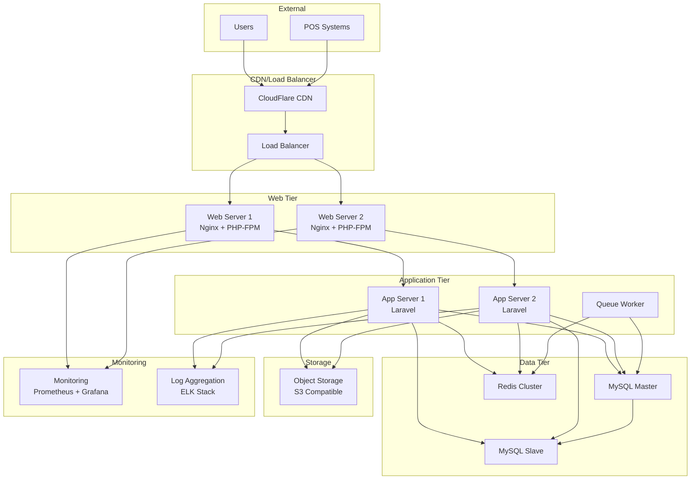

# インフラ・デプロイメント設計書

## 1. インフラ設計概要

### 1.1 設計方針
- **コンテナベース**: Docker + Laravel Sailによる開発・本番環境統一
- **スケーラビリティ**: 水平スケーリング対応
- **可用性**: 冗長化による高可用性確保
- **セキュリティ**: 多層防御によるセキュリティ強化
- **運用性**: 監視・ログ・バックアップの自動化

### 1.2 環境構成
- **開発環境**: Docker Compose (Laravel Sail)
- **ステージング環境**: Docker Compose + 本番類似構成
- **本番環境**: クラウドインフラ + Docker

## 2. 開発環境設計

### 2.1 Laravel Sail構成
```yaml
# docker-compose.yml (Laravel Sail)
version: '3'
services:
    laravel.test:
        build:
            context: ./vendor/laravel/sail/runtimes/8.1
            dockerfile: Dockerfile
            args:
                WWWGROUP: '${WWWGROUP}'
        image: sail-8.1/app
        extra_hosts:
            - 'host.docker.internal:host-gateway'
        ports:
            - '${APP_PORT:-80}:80'
            - '${VITE_PORT:-5173}:${VITE_PORT:-5173}'
        environment:
            WWWUSER: '${WWWUSER}'
            LARAVEL_SAIL: 1
            XDEBUG_MODE: '${SAIL_XDEBUG_MODE:-off}'
            XDEBUG_CONFIG: '${SAIL_XDEBUG_CONFIG:-client_host=host.docker.internal}'
        volumes:
            - '.:/var/www/html'
        networks:
            - sail
        depends_on:
            - mysql
            - redis
            - mailpit
    
    mysql:
        image: 'mysql/mysql-server:8.0'
        ports:
            - '${FORWARD_DB_PORT:-3306}:3306'
        environment:
            MYSQL_ROOT_PASSWORD: '${DB_PASSWORD}'
            MYSQL_ROOT_HOST: "%"
            MYSQL_DATABASE: '${DB_DATABASE}'
            MYSQL_USER: '${DB_USERNAME}'
            MYSQL_PASSWORD: '${DB_PASSWORD}'
            MYSQL_ALLOW_EMPTY_PASSWORD: 1
        volumes:
            - 'sail-mysql:/var/lib/mysql'
            - './vendor/laravel/sail/database/mysql/create-testing-database.sh:/docker-entrypoint-initdb.d/10-create-testing-database.sh'
        networks:
            - sail
        healthcheck:
            test: ["CMD", "mysqladmin", "ping", "-p${DB_PASSWORD}"]
            retries: 3
            timeout: 5s
    
    redis:
        image: 'redis:alpine'
        ports:
            - '${FORWARD_REDIS_PORT:-6379}:6379'
        volumes:
            - 'sail-redis:/data'
        networks:
            - sail
        healthcheck:
            test: ["CMD", "redis-cli", "ping"]
            retries: 3
            timeout: 5s
    
    mailpit:
        image: 'axllent/mailpit:latest'
        ports:
            - '${FORWARD_MAILPIT_PORT:-1025}:1025'
            - '${FORWARD_MAILPIT_DASHBOARD_PORT:-8025}:8025'
        networks:
            - sail

networks:
    sail:
        driver: bridge

volumes:
    sail-mysql:
        driver: local
    sail-redis:
        driver: local
```

### 2.2 開発環境用設定
```bash
# .env.example (開発環境)
APP_NAME="Mobile Order System"
APP_ENV=local
APP_KEY=
APP_DEBUG=true
APP_URL=http://localhost:8080
APP_PORT=8080

DB_CONNECTION=mysql
DB_HOST=mysql
DB_PORT=3306
DB_DATABASE=mobile_order
DB_USERNAME=sail
DB_PASSWORD=password

REDIS_HOST=redis
REDIS_PASSWORD=null
REDIS_PORT=6379

CACHE_DRIVER=redis
FILESYSTEM_DISK=local
QUEUE_CONNECTION=redis
SESSION_DRIVER=redis
SESSION_LIFETIME=120

MAIL_MAILER=smtp
MAIL_HOST=mailpit
MAIL_PORT=1025
MAIL_USERNAME=null
MAIL_PASSWORD=null
MAIL_ENCRYPTION=null
MAIL_FROM_ADDRESS="hello@example.com"
MAIL_FROM_NAME="${APP_NAME}"
```

## 3. 本番環境設計

### 3.1 システム構成図


### 3.2 サーバー仕様

#### Webサーバー (2台構成)
```yaml
# Web Server Specifications
CPU: 2 vCPU
Memory: 4GB RAM
Storage: 50GB SSD
OS: Ubuntu 20.04 LTS
Services:
  - Nginx 1.18+
  - PHP 8.1 (FPM)
  - Laravel Application
```

#### データベースサーバー
```yaml
# Database Master
CPU: 4 vCPU
Memory: 8GB RAM
Storage: 100GB SSD (高IOPS)
OS: Ubuntu 20.04 LTS
Services:
  - MySQL 8.0
  - Automated Backup

# Database Slave (Read Replica)
CPU: 2 vCPU
Memory: 4GB RAM
Storage: 100GB SSD
OS: Ubuntu 20.04 LTS
Services:
  - MySQL 8.0 (Slave)
```

#### Redisサーバー
```yaml
# Redis Cluster (3 nodes)
CPU: 2 vCPU per node
Memory: 4GB RAM per node
Storage: 20GB SSD per node
OS: Ubuntu 20.04 LTS
Services:
  - Redis 6.0+ (Cluster mode)
```

### 3.3 本番環境Docker構成
```dockerfile
# Dockerfile (Production)
FROM php:8.1-fpm-alpine

# Install system dependencies
RUN apk add --no-cache \
    nginx \
    supervisor \
    mysql-client \
    redis \
    git \
    curl \
    libpng-dev \
    libjpeg-turbo-dev \
    freetype-dev \
    zip \
    unzip

# Install PHP extensions
RUN docker-php-ext-configure gd --with-freetype --with-jpeg \
    && docker-php-ext-install -j$(nproc) \
        gd \
        pdo \
        pdo_mysql \
        bcmath \
        sockets \
        pcntl

# Install Composer
COPY --from=composer:latest /usr/bin/composer /usr/bin/composer

# Set working directory
WORKDIR /var/www/html

# Copy application files
COPY . .

# Install dependencies
RUN composer install --no-dev --optimize-autoloader

# Set permissions
RUN chown -R www-data:www-data /var/www/html \
    && chmod -R 755 /var/www/html/storage \
    && chmod -R 755 /var/www/html/bootstrap/cache

# Copy configuration files
COPY docker/nginx.conf /etc/nginx/nginx.conf
COPY docker/php-fpm.conf /usr/local/etc/php-fpm.d/www.conf
COPY docker/supervisord.conf /etc/supervisor/conf.d/supervisord.conf

# Expose port
EXPOSE 80

# Start supervisor
CMD ["/usr/bin/supervisord", "-c", "/etc/supervisor/conf.d/supervisord.conf"]
```

## 4. デプロイメント戦略

### 4.1 CI/CDパイプライン
```yaml
# .github/workflows/deploy.yml
name: Deploy to Production

on:
  push:
    branches: [ main ]

jobs:
  test:
    runs-on: ubuntu-latest
    services:
      mysql:
        image: mysql:8.0
        env:
          MYSQL_ALLOW_EMPTY_PASSWORD: yes
          MYSQL_DATABASE: mobile_order_test
        ports:
          - 3306:3306
        options: --health-cmd="mysqladmin ping" --health-interval=10s --health-timeout=5s --health-retries=3
      
      redis:
        image: redis
        ports:
          - 6379:6379
        options: --health-cmd="redis-cli ping" --health-interval=10s --health-timeout=5s --health-retries=3
    
    steps:
    - uses: actions/checkout@v3
    
    - name: Setup PHP
      uses: shivammathur/setup-php@v2
      with:
        php-version: '8.1'
        extensions: dom, curl, libxml, mbstring, zip, pcntl, pdo, sqlite, pdo_sqlite, bcmath, soap, intl, gd, exif, iconv
    
    - name: Copy .env
      run: php -r "file_exists('.env') || copy('.env.testing', '.env');"
    
    - name: Install dependencies
      run: composer install -q --no-ansi --no-interaction --no-scripts --no-progress --prefer-dist
    
    - name: Generate key
      run: php artisan key:generate
    
    - name: Directory Permissions
      run: chmod -R 777 storage bootstrap/cache
    
    - name: Run Tests
      run: php artisan test --coverage --min=80
      env:
        DB_CONNECTION: mysql
        DB_HOST: 127.0.0.1
        DB_PORT: 3306
        DB_DATABASE: mobile_order_test
        DB_USERNAME: root
        DB_PASSWORD: ''
        REDIS_HOST: 127.0.0.1
        REDIS_PORT: 6379
  
  build:
    needs: test
    runs-on: ubuntu-latest
    
    steps:
    - uses: actions/checkout@v3
    
    - name: Build Docker image
      run: |
        docker build -t mobile-order:${{ github.sha }} .
        docker tag mobile-order:${{ github.sha }} mobile-order:latest
    
    - name: Push to Registry
      run: |
        echo ${{ secrets.DOCKER_PASSWORD }} | docker login -u ${{ secrets.DOCKER_USERNAME }} --password-stdin
        docker push mobile-order:${{ github.sha }}
        docker push mobile-order:latest
  
  deploy:
    needs: build
    runs-on: ubuntu-latest
    
    steps:
    - name: Deploy to Production
      uses: appleboy/ssh-action@v0.1.5
      with:
        host: ${{ secrets.PROD_HOST }}
        username: ${{ secrets.PROD_USERNAME }}
        key: ${{ secrets.PROD_SSH_KEY }}
        script: |
          cd /opt/mobile-order
          docker-compose pull
          docker-compose up -d --no-deps web
          docker-compose exec web php artisan migrate --force
          docker-compose exec web php artisan config:cache
          docker-compose exec web php artisan route:cache
          docker-compose exec web php artisan view:cache
```

### 4.2 Blue-Green デプロイメント
```bash
#!/bin/bash
# deploy.sh - Blue-Green Deployment Script

set -e

CURRENT=$(docker-compose ps --services --filter status=running | grep web)
if [ "$CURRENT" = "web-blue" ]; then
    NEW_ENV="green"
    OLD_ENV="blue"
else
    NEW_ENV="blue"
    OLD_ENV="green"
fi

echo "Deploying to $NEW_ENV environment..."

# Pull new image
docker-compose pull web-$NEW_ENV

# Start new environment
docker-compose up -d web-$NEW_ENV

# Wait for health check
echo "Waiting for health check..."
for i in {1..30}; do
    if curl -f http://localhost:8081/health; then
        echo "Health check passed"
        break
    fi
    sleep 10
done

# Update load balancer
echo "Switching traffic to $NEW_ENV..."
sed -i "s/web-$OLD_ENV/web-$NEW_ENV/g" /etc/nginx/sites-available/mobile-order
nginx -s reload

# Wait before stopping old environment
sleep 30

# Stop old environment
echo "Stopping $OLD_ENV environment..."
docker-compose stop web-$OLD_ENV

echo "Deployment completed successfully"
```

### 4.3 ロールバック戦略
```bash
#!/bin/bash
# rollback.sh - Rollback Script

set -e

echo "Starting rollback process..."

# Identify current and previous versions
CURRENT=$(docker images --format "table {{.Repository}}:{{.Tag}}" | grep mobile-order | head -1)
PREVIOUS=$(docker images --format "table {{.Repository}}:{{.Tag}}" | grep mobile-order | head -2 | tail -1)

echo "Rolling back from $CURRENT to $PREVIOUS"

# Update docker-compose to use previous version
sed -i "s|image: $CURRENT|image: $PREVIOUS|g" docker-compose.prod.yml

# Deploy previous version
docker-compose -f docker-compose.prod.yml up -d web

# Run any necessary rollback migrations
docker-compose -f docker-compose.prod.yml exec web php artisan migrate:rollback --step=1

echo "Rollback completed successfully"
```

## 5. 監視・ログ設計

### 5.1 アプリケーション監視
```php
// app/Http/Middleware/MetricsMiddleware.php
class MetricsMiddleware
{
    public function handle($request, Closure $next)
    {
        $startTime = microtime(true);
        
        $response = $next($request);
        
        $duration = microtime(true) - $startTime;
        
        // Prometheus metrics
        app('prometheus.http_requests_total')
            ->labels([
                'method' => $request->method(),
                'route' => $request->route()?->getName() ?? 'unknown',
                'status_code' => $response->getStatusCode(),
            ])
            ->inc();
            
        app('prometheus.http_request_duration_seconds')
            ->labels([
                'method' => $request->method(),
                'route' => $request->route()?->getName() ?? 'unknown',
            ])
            ->observe($duration);
        
        return $response;
    }
}
```

### 5.2 ヘルスチェックエンドポイント
```php
// app/Http/Controllers/HealthController.php
class HealthController extends Controller
{
    public function check()
    {
        $checks = [
            'database' => $this->checkDatabase(),
            'redis' => $this->checkRedis(),
            'storage' => $this->checkStorage(),
            'queue' => $this->checkQueue(),
        ];
        
        $healthy = collect($checks)->every(fn($check) => $check['status'] === 'ok');
        
        return response()->json([
            'status' => $healthy ? 'ok' : 'error',
            'timestamp' => now()->toISOString(),
            'checks' => $checks,
        ], $healthy ? 200 : 503);
    }
    
    private function checkDatabase(): array
    {
        try {
            DB::connection()->getPdo();
            return ['status' => 'ok', 'message' => 'Database connection successful'];
        } catch (Exception $e) {
            return ['status' => 'error', 'message' => $e->getMessage()];
        }
    }
    
    private function checkRedis(): array
    {
        try {
            Redis::ping();
            return ['status' => 'ok', 'message' => 'Redis connection successful'];
        } catch (Exception $e) {
            return ['status' => 'error', 'message' => $e->getMessage()];
        }
    }
}
```

### 5.3 ログ設定
```php
// config/logging.php (Production)
'channels' => [
    'stack' => [
        'driver' => 'stack',
        'channels' => ['daily', 'slack'],
        'ignore_exceptions' => false,
    ],
    
    'daily' => [
        'driver' => 'daily',
        'path' => storage_path('logs/laravel.log'),
        'level' => env('LOG_LEVEL', 'debug'),
        'days' => 365,
        'replace_placeholders' => true,
    ],
    
    'slack' => [
        'driver' => 'slack',
        'url' => env('LOG_SLACK_WEBHOOK_URL'),
        'username' => 'Laravel Log',
        'emoji' => ':boom:',
        'level' => 'error',
    ],
    
    'syslog' => [
        'driver' => 'syslog',
        'level' => env('LOG_LEVEL', 'debug'),
        'facility' => LOG_USER,
        'replace_placeholders' => true,
    ],
],
```

## 6. セキュリティ設定

### 6.1 Nginx設定
```nginx
# /etc/nginx/sites-available/mobile-order
server {
    listen 80;
    server_name example.com;
    return 301 https://$server_name$request_uri;
}

server {
    listen 443 ssl http2;
    server_name example.com;
    root /var/www/html/public;
    index index.php;
    
    # SSL Configuration
    ssl_certificate /etc/ssl/certs/example.com.crt;
    ssl_certificate_key /etc/ssl/private/example.com.key;
    ssl_protocols TLSv1.2 TLSv1.3;
    ssl_ciphers ECDHE-RSA-AES256-GCM-SHA512:DHE-RSA-AES256-GCM-SHA512:ECDHE-RSA-AES256-GCM-SHA384:DHE-RSA-AES256-GCM-SHA384;
    ssl_prefer_server_ciphers off;
    
    # Security Headers
    add_header X-Content-Type-Options nosniff;
    add_header X-Frame-Options DENY;
    add_header X-XSS-Protection "1; mode=block";
    add_header Strict-Transport-Security "max-age=31536000; includeSubDomains" always;
    add_header Referrer-Policy "strict-origin-when-cross-origin";
    
    # Rate Limiting
    limit_req_zone $binary_remote_addr zone=api:10m rate=10r/s;
    limit_req_zone $binary_remote_addr zone=web:10m rate=5r/s;
    
    # API Routes
    location /api/ {
        limit_req zone=api burst=20 nodelay;
        try_files $uri $uri/ /index.php?$query_string;
    }
    
    # Web Routes
    location / {
        limit_req zone=web burst=10 nodelay;
        try_files $uri $uri/ /index.php?$query_string;
    }
    
    # PHP-FPM
    location ~ \.php$ {
        fastcgi_pass unix:/var/run/php/php8.1-fpm.sock;
        fastcgi_param SCRIPT_FILENAME $realpath_root$fastcgi_script_name;
        include fastcgi_params;
        fastcgi_hide_header X-Powered-By;
    }
    
    # Static files caching
    location ~* \.(js|css|png|jpg|jpeg|gif|ico|svg)$ {
        expires 1y;
        add_header Cache-Control "public, immutable";
    }
    
    # Deny access to sensitive files
    location ~ /\. {
        deny all;
    }
    
    location ~ /composer\.(json|lock) {
        deny all;
    }
    
    location ~ /\.env {
        deny all;
    }
}
```

### 6.2 ファイアウォール設定
```bash
#!/bin/bash
# firewall.sh - UFW Configuration

# Reset UFW
ufw --force reset

# Default policies
ufw default deny incoming
ufw default allow outgoing

# SSH (限定的なIPからのみ)
ufw allow from 192.168.1.0/24 to any port 22

# HTTP/HTTPS
ufw allow 80/tcp
ufw allow 443/tcp

# MySQL (アプリケーションサーバーからのみ)
ufw allow from 10.0.1.0/24 to any port 3306

# Redis (アプリケーションサーバーからのみ)
ufw allow from 10.0.1.0/24 to any port 6379

# Enable UFW
ufw --force enable

echo "Firewall configuration completed"
```

## 7. バックアップ・復旧

### 7.1 データベースバックアップ
```bash
#!/bin/bash
# backup-db.sh - Database Backup Script

set -e

BACKUP_DIR="/opt/backups/mysql"
DATE=$(date +%Y%m%d_%H%M%S)
BACKUP_FILE="mobile_order_${DATE}.sql.gz"
RETENTION_DAYS=30

# Create backup directory
mkdir -p $BACKUP_DIR

# Create backup
mysqldump --single-transaction --routines --triggers \
    -u $DB_USERNAME -p$DB_PASSWORD \
    $DB_DATABASE | gzip > $BACKUP_DIR/$BACKUP_FILE

# Upload to S3 (optional)
aws s3 cp $BACKUP_DIR/$BACKUP_FILE s3://mobile-order-backups/mysql/

# Clean old backups
find $BACKUP_DIR -name "mobile_order_*.sql.gz" -mtime +$RETENTION_DAYS -delete

echo "Database backup completed: $BACKUP_FILE"
```

### 7.2 アプリケーションバックアップ
```bash
#!/bin/bash
# backup-app.sh - Application Backup Script

set -e

BACKUP_DIR="/opt/backups/app"
DATE=$(date +%Y%m%d_%H%M%S)
BACKUP_FILE="app_${DATE}.tar.gz"
APP_DIR="/var/www/html"

# Create backup directory
mkdir -p $BACKUP_DIR

# Create application backup (excluding cache and logs)
tar --exclude='storage/logs/*' \
    --exclude='storage/framework/cache/*' \
    --exclude='storage/framework/sessions/*' \
    --exclude='storage/framework/views/*' \
    --exclude='node_modules' \
    --exclude='.git' \
    -czf $BACKUP_DIR/$BACKUP_FILE -C $APP_DIR .

# Upload to S3
aws s3 cp $BACKUP_DIR/$BACKUP_FILE s3://mobile-order-backups/app/

# Clean old backups
find $BACKUP_DIR -name "app_*.tar.gz" -mtime +7 -delete

echo "Application backup completed: $BACKUP_FILE"
```

### 7.3 復旧手順
```bash
#!/bin/bash
# restore.sh - Database Restore Script

set -e

if [ -z "$1" ]; then
    echo "Usage: $0 <backup_file>"
    exit 1
fi

BACKUP_FILE=$1

echo "Starting database restore from $BACKUP_FILE"

# Stop application
docker-compose stop web

# Drop and recreate database
mysql -u $DB_USERNAME -p$DB_PASSWORD -e "DROP DATABASE IF EXISTS $DB_DATABASE;"
mysql -u $DB_USERNAME -p$DB_PASSWORD -e "CREATE DATABASE $DB_DATABASE;"

# Restore database
zcat $BACKUP_FILE | mysql -u $DB_USERNAME -p$DB_PASSWORD $DB_DATABASE

# Start application
docker-compose start web

# Clear caches
docker-compose exec web php artisan cache:clear
docker-compose exec web php artisan config:clear
docker-compose exec web php artisan route:clear
docker-compose exec web php artisan view:clear

echo "Database restore completed successfully"
```

## 8. 災害復旧計画

### 8.1 RTO/RPO目標
- **RTO (Recovery Time Objective)**: 2時間
- **RPO (Recovery Point Objective)**: 4時間
- **最大許容ダウンタイム**: 平日8時間、休日24時間

### 8.2 災害復旧手順
```markdown
# 災害復旧手順書

## 1. 初期対応 (0-15分)
1. 障害の検知・確認
2. 関係者への連絡
3. 障害レベルの判断

## 2. 応急処置 (15-30分)
1. 代替手段の案内
2. 外部からのアクセス遮断（必要に応じて）
3. データ損失の防止

## 3. 復旧作業 (30分-2時間)
1. バックアップからのデータ復旧
2. アプリケーションの復旧
3. 動作確認

## 4. 事後対応 (復旧後)
1. サービス再開の案内
2. 原因分析
3. 再発防止策の検討
```

## 9. 運用手順書

### 9.1 日次運用タスク
```bash
#!/bin/bash
# daily-maintenance.sh

echo "=== Daily Maintenance Started ==="

# 1. システム状態確認
echo "Checking system status..."
docker-compose ps
systemctl status nginx mysql redis

# 2. ディスク使用量確認
echo "Checking disk usage..."
df -h

# 3. ログローテーション確認
echo "Checking log rotation..."
logrotate -d /etc/logrotate.d/mobile-order

# 4. バックアップ確認
echo "Checking backup status..."
ls -la /opt/backups/mysql/$(date +%Y%m%d)*

# 5. パフォーマンス確認
echo "Checking performance metrics..."
curl -s http://localhost/health | jq

echo "=== Daily Maintenance Completed ==="
```

### 9.2 週次運用タスク
```bash
#!/bin/bash
# weekly-maintenance.sh

echo "=== Weekly Maintenance Started ==="

# 1. セキュリティアップデート
echo "Checking security updates..."
apt list --upgradable | grep -i security

# 2. ログ分析
echo "Analyzing error logs..."
grep -c "ERROR" /var/log/mobile-order/laravel-$(date +%Y-%m-%d).log

# 3. パフォーマンステスト
echo "Running performance test..."
ab -n 100 -c 10 http://localhost/api/v1/menu-items

# 4. データベース最適化
echo "Optimizing database..."
mysql -u $DB_USERNAME -p$DB_PASSWORD $DB_DATABASE -e "OPTIMIZE TABLE orders, order_items, menu_items;"

echo "=== Weekly Maintenance Completed ==="
```

---

このインフラ・デプロイメント設計書に従って環境を構築することで、スケーラブルで安全なモバイルオーダーシステムを運用できます。定期的な見直しと改善により、サービスの品質向上を継続的に図ることが重要です。