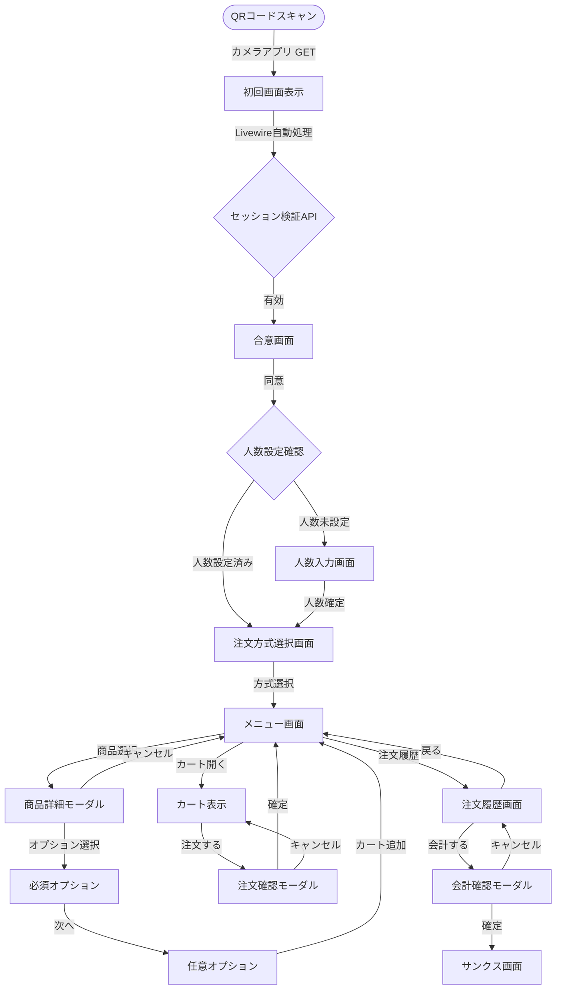
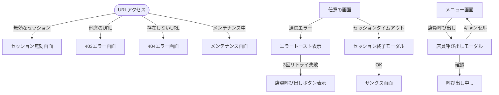
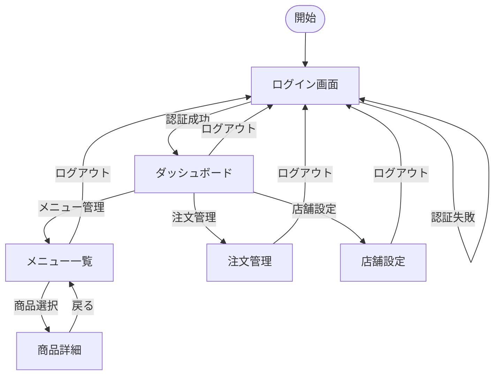

# 画面遷移フロー設計書

## 📚 目次

- [1. 概要](#1-概要)
- [2. 画面一覧](#2-画面一覧)
  - [2.1 お客様向け画面](#21-お客様向け画面)
  - [2.2 管理者向け画面](#22-管理者向け画面)
- [3. お客様向け画面遷移フロー](#3-お客様向け画面遷移フロー)
  - [3.1 基本フロー](#31-基本フロー)
  - [3.2 共通要素](#32-共通要素)
  - [3.3 エラー・例外処理](#33-エラー例外処理)
  - [3.4 画面別詳細仕様](#34-画面別詳細仕様)
- [4. 管理者向け画面遷移フロー](#4-管理者向け画面遷移フロー)
  - [4.1 基本フロー](#41-基本フロー)
  - [4.2 管理画面の特徴](#42-管理画面の特徴)
  - [4.3 管理画面URLの設定方法](#43-管理画面urlの設定方法)
  - [4.4 複数店舗運用時のURL管理（パスベース方式）](#44-複数店舗運用時のurl管理パスベース方式)
- [5. 状態管理](#5-状態管理)
  - [5.1 セッション管理](#51-セッション管理)
  - [5.2 画面間データ引き継ぎ](#52-画面間データ引き継ぎ)
- [6. レスポンシブ対応](#6-レスポンシブ対応)
  - [6.1 ブレークポイント](#61-ブレークポイント)
  - [6.2 デバイス別最適化](#62-デバイス別最適化)
- [7. パフォーマンス考慮事項](#7-パフォーマンス考慮事項)
  - [7.1 画面遷移の最適化](#71-画面遷移の最適化)
  - [7.2 リアルタイム更新](#72-リアルタイム更新)
- [8. 実装優先順位](#8-実装優先順位)
- [9. 注意事項](#9-注意事項)
  - [9.1 ブラウザバック対策](#91-ブラウザバック対策)
  - [9.2 セキュリティ](#92-セキュリティ)
  - [9.3 アクセシビリティ](#93-アクセシビリティ)

---

## 1. 概要

本ドキュメントは、Mobile Order Systemの画面遷移フローを定義します。
お客様向け画面と管理者向け画面の2系統で構成されています。

## 2. 画面一覧

### 2.1 お客様向け画面

| 画面ID | 画面名 | パス | 説明 |
|--------|--------|------|------|
| C-000 | 合意画面 | `/s/{session_token}/agreement` | ハンドルキーパー・セキュリティポリシー同意 |
| C-001 | 人数入力画面 | `/s/{session_token}` | QRコードからの着地・利用人数入力 |
| C-002 | サンクス画面 | `/thanks` | 利用終了後の表示画面 |
| C-003 | 注文方式選択画面 | `/order/select-mode` | 画像選択or番号入力を選択 |
| C-004 | メニュー画面 | `/menu` | 商品選択・注文のメイン画面 |
| C-005 | 商品詳細モーダル | - | 商品オプション選択（モーダル） |
| C-006 | カート表示 | - | 下部固定ミニカート＋全画面展開 |
| C-007 | 注文確認モーダル | - | 注文最終確認（モーダル） |
| C-008 | 注文履歴画面 | `/order-history` | 注文状況確認・割り勘計算 |
| C-009 | 会計確認モーダル | - | 会計前の最終確認 |
| C-010 | エラートースト | - | エラー通知（トースト） |
| C-011 | 店員呼び出しモーダル | - | 店員呼び出し確認 |
| C-012 | セッション終了モーダル | - | タイムアウト通知 |
| C-013 | 404エラー画面 | `/error/404` | 存在しないページへの直接アクセス |
| C-014 | 403エラー画面 | `/error/403` | 他の席URLへの不正アクセス |
| C-015 | セッション無効画面 | `/error/invalid-session` | 期限切れQRコード使用時 |
| C-016 | メンテナンス画面 | `/maintenance` | システムメンテナンス中 |

### 2.2 管理者向け画面

| 画面ID | 画面名 | パス | 説明 |
|--------|--------|------|------|
| A-001 | ログイン画面 | `/{admin_prefix}` | 管理者認証 |
| A-002 | ダッシュボード | `/{admin_prefix}/dashboard` | 売上・注文状況サマリー |
| A-003 | メニュー管理（一覧） | `/{admin_prefix}/menu` | 商品・カテゴリ一覧（読み取り専用） |
| A-004 | メニュー管理（詳細） | `/{admin_prefix}/menu/{id}` | 商品詳細表示（読み取り専用） |
| A-005 | 注文管理 | `/{admin_prefix}/orders` | リアルタイム注文管理 |
| A-006 | 店舗設定 | `/{admin_prefix}/settings` | 営業時間・言語・表示設定 |

## 3. お客様向け画面遷移フロー

### 3.1 基本フロー

#### 技術的フロー説明
1. **QRコード読み取り**: カメラアプリで `https://example.com/s/{session_token}` をGET取得
2. **初回画面表示**: URLルーティングで人数入力画面等を表示
3. **セッション検証**: Livewire/JavaScript で `POST /api/v1/auth/session/start` を自動実行
4. **ゲストセッション**: 成功後に `POST /api/v1/auth/guest/start` でゲストトークン生成



### 3.2 共通要素

#### ヘッダー（全画面共通）
- **言語切替ボタン**: 日本語/英語/中国語（繁体・簡体）/韓国語
- **注文履歴ボタン**: メニュー画面から遷移可能
- **店舗ロゴ/名称**: タップでメニュー画面へ

#### 下部固定カート（メニュー画面）
- 常時表示: カート状態と注文促進UI
- タップで全画面展開
- アニメーション: 下からスライドアップ

**UIデザイン仕様：**
```
┌──────────────────────────────────────┐
│  🛒 カート (3点)           ¥2,500    │
│  ▼ タップして注文内容を確認 ▼       │
└──────────────────────────────────────┘
```

**視覚的工夫：**
1. **2段構成**: 上段に商品数と金額、下段にアクション誘導
2. **背景色**: 目立つ色（primary color）でグラデーション
3. **パルスアニメーション**: 商品追加時に軽く光る
4. **矢印アイコン**: ▼ または 上向きのシェブロンで開く方向を示唆
5. **高さ**: 80-100px（タップしやすいサイズ）

**状態別の表示：**
```
【カート空の時】
┌──────────────────────────────────────┐
│  🛒 カートは空です                   │
│  商品を選択してください              │
└──────────────────────────────────────┘
（グレーアウト・タップ不可）

【商品追加時】
┌──────────────────────────────────────┐
│  🛒 カート (1点)            ¥500     │ ← 追加アニメーション
│  ▼ タップして注文へ進む ▼          │    (軽く光る)
└──────────────────────────────────────┘
（オレンジ系の目立つ色）

【カート展開中】
┌──────────────────────────────────────┐
│  🛒 カート (3点)           ¥2,500    │
│  ▲ タップして閉じる ▲              │
└──────────────────────────────────────┘
（矢印が上向きに変化）
```

### 3.3 エラー・例外処理



### 3.4 画面別詳細仕様

#### C-000: 合意画面
```
┌─────────────────────────────────┐
│ ヘッダー                          │
│ [言語切替] [店舗ロゴ]              │
├─────────────────────────────────┤
│                                 │
│ ご利用にあたって                  │
│                                 │
│ 当店のモバイル注文システムをご利用    │
│ いただきありがとうございます。      │
│                                 │
│ □ ハンドルキーパーポリシーに同意    │
│   （飲酒運転防止への協力）           │
│                                 │
│ □ セキュリティポリシーに同意        │
│   （個人情報の適切な取り扱い）       │
│                                 │
│ 詳細はこちら→ [利用規約]           │
│                                 │
├─────────────────────────────────┤
│          [同意して続ける]          │
└─────────────────────────────────┘
```

**機能**
- **ハンドルキーパーポリシー**: 飲酒運転防止に関する確認
- **セキュリティポリシー**: 個人情報保護・システム利用に関する同意
- **利用規約リンク**: 詳細確認用（別タブで開く）
- **同意必須**: 両方にチェック後に「同意して続ける」ボタンが有効化

**多言語対応**
- 日本語: 「ハンドルキーパーポリシーに同意」
- 英語: 「Agree to Designated Driver Policy」
- 中国語（繁体）: 「同意指定駕駛政策」
- 中国語（簡体）: 「同意指定驾驶政策」  
- 韓国語: 「지정운전자 정책에 동의」

#### C-004: メニュー画面
```
┌─────────────────────────────────┐
│ ヘッダー                          │
│ [言語] [注文履歴] [店員呼出]      │
├─────────────────────────────────┤
│ タブ: [画像で選ぶ｜番号で入力]     │
├─────────────────────────────────┤
│                                  │
│  ▼画像モード                     │
│  ┌────┐ ┌────┐ ┌────┐        │
│  │商品│ │商品│ │商品│        │
│  └────┘ └────┘ └────┘        │
│                                  │
│  ▼番号モード                     │
│  商品番号 [    ] [追加]          │
│                                  │
├─────────────────────────────────┤
│  🛒 カート (3点)        ¥2,500   │
│  ▼ タップして注文へ進む ▼       │
└─────────────────────────────────┘
```

#### C-008: 注文履歴画面
```
┌─────────────────────────────────┐
│ ヘッダー: 注文履歴              │
├─────────────────────────────────┤
│ 🐶 12:30に注文 [受付中]         │
│   醤油ラーメン ×1  ¥800        │
│   餃子 ×1         ¥400        │
│   小計: ¥1,200                  │
├─────────────────────────────────┤
│ 🐱 12:35に注文 [調理中]         │
│   味噌ラーメン ×2  ¥1,800      │
│   小計: ¥1,800                  │
├─────────────────────────────────┤
│ 合計: ¥3,000                    │
│ 1人あたり: ¥1,000（3人）        │
├─────────────────────────────────┤
│    [会計する（¥3,000）]         │
└─────────────────────────────────┘
```

**注文者識別**:
- 動物アイコン（🐶🐱🐰🐼🦊🐸など）で個人を識別
- 同一端末の注文は同じアイコンで統一
- プライバシー保護のため名前は表示しない

**割り勘計算**:
- 席の利用人数で自動計算
- 1円単位は切り上げで調整
- 人数変更時は再計算

### 3.5 POS障害時の画面表示

#### ステータス: warning（30秒無応答）
```
┌───────────────────────────────────┐
│ ⚠️ 現在通信が混み合っています     │
│  しばらくお待ちください          │
└───────────────────────────────────┘
※ 注文ボタン無効化
```

#### ステータス: error（90秒無応答）
```
┌───────────────────────────────────┐
│ ❌ システムエラー                    │
│                                  │
│  システムの復旧までしばらく        │
│  お待ちください。                │
│                                  │
│  お急ぎの方は従業員を            │
│  お呼びください。                │
│                                  │
│  [店員を呼ぶ]                    │
└───────────────────────────────────┘
※ 注文ボタン無効化
```

#### ステータス: syncing（同期処理中）
```
┌───────────────────────────────────┐
│ 🔄 システム復旧中                    │
│                                  │
│  システムが復旧中です。          │
│  しばらくお待ちください。        │
│                                  │
│  ●●●                            │
└───────────────────────────────────┘
※ 注文ボタン無効化
```

#### 同期処理後の通知（影響を受けた席）
```
┌───────────────────────────────────┐
│ ⚠️ 重要なお知らせ                   │
│                                  │
│  システム復旧のため、受付中の      │
│  注文がクリアされました。        │
│                                  │
│  注文履歴をご確認の上、        │
│  再度ご注文ください。          │
│                                  │
│  [注文履歴を確認]                │
└───────────────────────────────────┘
```

### 3.6 エラー画面詳細

#### C-013〜C-016: エラー画面

**C-013: 404エラー画面**
```
メッセージ: 「お探しのページが見つかりません」
説明: 存在しない商品IDやページへの直接アクセス時
アクション: なし（ブラウザバックのみ）
```

**C-014: 403エラー画面**
```
メッセージ: 「このページにはアクセスできません」
説明: 他の席のセッションURLへアクセス時
アクション: なし（ブラウザバックのみ）
```

**C-015: セッション無効画面**
```
メッセージ: 「このQRコードは有効期限が切れています」
サブメッセージ: 「レジで新しいQRコードを発行してください」
アクション: なし（店員対応必要）
```

**C-016: メンテナンス画面**
```
メッセージ: 「ただいまメンテナンス中です」
サブメッセージ: 「しばらくお待ちください」
表示内容: メンテナンス終了予定時刻（設定されている場合）
アクション: なし（自動リロード機能検討）
```

## 4. 管理者向け画面遷移フロー

### 4.1 基本フロー



### 4.2 管理画面の特徴
- **認証**: Laravel Breeze (セッション/Cookie)
- **アクセス**: 環境変数で設定した推測困難なURLパス
- **権限**: 管理者ロールのみアクセス可能
- **自動ログアウト**: 3時間操作なしでセッション終了

### 4.3 管理画面URLの設定方法

#### 環境変数での設定
```bash
# .env
ADMIN_URL_PREFIX=mo-ctrl-2025  # 本番環境では必ず変更すること
```

#### 推奨される命名パターン
- ランダム文字列: `admin-x7k9m2p4`
- 店舗コード＋ランダム: `store001-ctrl-8a3f`
- 日付＋ランダム: `2024-mgmt-k5n2`

#### 実装例
```php
// config/app.php
'admin_prefix' => env('ADMIN_URL_PREFIX', 'admin'),

// routes/web.php
Route::prefix(config('app.admin_prefix'))->middleware(['auth', 'admin'])->group(function () {
    Route::get('/', [AdminController::class, 'login'])->withoutMiddleware(['auth', 'admin']);
    Route::get('/dashboard', [DashboardController::class, 'index']);
    Route::get('/menu', [MenuController::class, 'index']);
    Route::get('/orders', [OrderController::class, 'index']);
    Route::get('/settings', [SettingsController::class, 'index']);
});
```

#### セキュリティ上の注意事項
1. **本番環境では必ず変更**: デフォルト値を使用しない
2. **定期的な変更**: 可能であれば3-6ヶ月ごとに変更
3. **アクセスログ監視**: 不正アクセス試行を検知
4. **アクセス監視**: 不審なアクセスパターンの検知と記録
5. **URL共有禁止**: メールやチャットでのURL共有は避ける

### 4.4 複数店舗運用時のURL管理（パスベース方式）
```
店舗A: https://example.com/store-a/ctrl-x7k9
店舗B: https://example.com/store-b/ctrl-m2p4
```

**データベース設計：**
```php
// stores テーブル
Schema::create('stores', function (Blueprint $table) {
    $table->id();
    $table->string('code')->unique();  // 店舗コード（変更不可）
    $table->string('name');
    $table->json('settings');
    $table->timestamps();
});

// store_admin_urls テーブル（URL履歴管理）
Schema::create('store_admin_urls', function (Blueprint $table) {
    $table->id();
    $table->foreignId('store_id')->constrained()->onDelete('cascade');
    $table->string('url_prefix');  // 管理画面URLプレフィックス
    $table->boolean('is_active')->default(true);
    $table->timestamp('activated_at');
    $table->timestamp('deactivated_at')->nullable();
    $table->foreignId('created_by')->nullable();  // 変更者
    $table->string('change_reason')->nullable();  // 変更理由
    $table->timestamps();
    
    $table->unique(['store_id', 'url_prefix']);  // 同一店舗で重複URL禁止
    $table->index(['store_id', 'is_active']);
});
```

**管理ポータルでのURL変更機能：**
```php
// Livewire Component: StoreUrlManager.php
class StoreUrlManager extends Component
{
    public Store $store;
    public $newUrlPrefix = '';
    public $changeReason = '';
    public $confirmChange = false;
    
    public function generateRandomUrl()
    {
        $this->newUrlPrefix = 'ctrl-' . Str::random(8);
    }
    
    public function validateUrl()
    {
        $this->validate([
            'newUrlPrefix' => [
                'required',
                'regex:/^[a-z0-9\-]+$/',  // 英小文字、数字、ハイフンのみ
                'min:8',
                'max:32',
                Rule::unique('store_admin_urls', 'url_prefix')
                    ->where('store_id', '!=', $this->store->id)
            ],
            'changeReason' => 'required|min:10'
        ]);
    }
    
    public function changeUrl()
    {
        DB::transaction(function () {
            // 現在のURLを無効化
            $this->store->adminUrls()
                ->where('is_active', true)
                ->update([
                    'is_active' => false,
                    'deactivated_at' => now()
                ]);
            
            // 新しいURLを有効化
            $this->store->adminUrls()->create([
                'url_prefix' => $this->newUrlPrefix,
                'is_active' => true,
                'activated_at' => now(),
                'created_by' => auth()->id(),
                'change_reason' => $this->changeReason
            ]);
            
            // 管理者全員に通知
            $this->notifyAdmins();
            
            // キャッシュクリア（DBキャッシュのため特定キーのクリア）
            Cache::forget('store-urls-' . $this->store->id);
        });
        
        session()->flash('message', 'URL変更完了。新URL: /' . $this->store->code . '/' . $this->newUrlPrefix);
    }
}
```

**管理画面UI：**
```blade
{{-- 店舗設定画面内のURL管理セクション --}}
<div class="card">
    <h3>管理画面URL設定</h3>
    
    <div class="current-url">
        <label>現在のURL:</label>
        <code>{{ url($store->code . '/' . $store->currentAdminUrl->url_prefix) }}</code>
        <button wire:click="copyToClipboard" class="btn-sm">コピー</button>
    </div>
    
    <div class="change-url-form">
        <label>新しいURLプレフィックス:</label>
        <div class="input-group">
            <span>/{{ $store->code }}/</span>
            <input wire:model="newUrlPrefix" 
                   placeholder="ctrl-xxxxxxxx"
                   pattern="[a-z0-9\-]+"
                   minlength="8"
                   maxlength="32">
            <button wire:click="generateRandomUrl" class="btn-secondary">
                ランダム生成
            </button>
        </div>
        @error('newUrlPrefix') <span class="error">{{ $message }}</span> @enderror
        
        <label>変更理由（監査ログ用）:</label>
        <textarea wire:model="changeReason" required></textarea>
        @error('changeReason') <span class="error">{{ $message }}</span> @enderror
        
        @if($confirmChange)
            <div class="alert alert-warning">
                <p>本当にURLを変更しますか？</p>
                <p>変更後、全管理者に新URLが通知されます。</p>
                <button wire:click="changeUrl" class="btn-danger">変更実行</button>
                <button wire:click="$set('confirmChange', false)" class="btn-secondary">キャンセル</button>
            </div>
        @else
            <button wire:click="$set('confirmChange', true)" class="btn-primary">
                URL変更
            </button>
        @endif
    </div>
    
    <div class="url-history">
        <h4>URL変更履歴</h4>
        <table>
            <thead>
                <tr>
                    <th>URL</th>
                    <th>有効期間</th>
                    <th>変更者</th>
                    <th>変更理由</th>
                </tr>
            </thead>
            <tbody>
                @foreach($store->adminUrls()->orderBy('created_at', 'desc')->limit(10)->get() as $url)
                    <tr class="{{ $url->is_active ? 'active' : '' }}">
                        <td><code>/{{ $store->code }}/{{ $url->url_prefix }}</code></td>
                        <td>
                            {{ $url->activated_at->format('Y/m/d H:i') }}
                            @if($url->deactivated_at)
                                〜 {{ $url->deactivated_at->format('Y/m/d H:i') }}
                            @else
                                〜 (現在有効)
                            @endif
                        </td>
                        <td>{{ $url->creator->name ?? 'システム' }}</td>
                        <td>{{ $url->change_reason }}</td>
                    </tr>
                @endforeach
            </tbody>
        </table>
    </div>
</div>
```

**セキュリティ機能：**
```php
// URL変更時の通知
class AdminUrlChangedNotification extends Notification
{
    public function toMail($notifiable)
    {
        return (new MailMessage)
            ->subject('【重要】管理画面URLが変更されました')
            ->line('管理画面のURLが変更されました。')
            ->line('新しいURL: ' . $this->newUrl)
            ->line('変更理由: ' . $this->changeReason)
            ->action('新しい管理画面へ', $this->newUrl)
            ->line('このメールは削除せず保管してください。');
    }
}

// 不正アクセス検知
class DetectInvalidAdminAccess
{
    public function handle($request, Closure $next)
    {
        $path = $request->path();
        
        // 無効なURL or 存在しない店舗へのアクセス
        if ($this->isInvalidAdminUrl($path)) {
            // ログ記録
            Log::warning('Invalid admin access attempt', [
                'ip' => $request->ip(),
                'path' => $path,
                'user_agent' => $request->userAgent()
            ]);
            
            // 一定回数以上でアクセス制限
            $this->checkAndLimitAccess($request->ip());
            
            abort(404);
        }
        
        return $next($request);
    }
}
```

## 5. 状態管理

### 5.1 セッション管理

| セッション種別 | 用途 | TTL | 保存先 |
|--------------|------|-----|--------|
| 席セッション | QRコード単位の管理 | 3時間 | DB (sessions) |
| ゲストセッション | 個人端末識別 | 30分（自動延長） | DB (guest_sessions) |
| カート情報 | 注文前の商品 | 30分（自動延長） | DB (carts + cart_logs) |
| 管理者セッション | 管理画面認証 | 3時間 | セッション/Cookie |

### 5.2 画面間データ引き継ぎ

```
QRコード読み取り
  └→ session_token (新規生成)
     └→ 人数入力
        └→ customer_count
           └→ 注文方式選択
              └→ order_mode (image/number)
                 └→ メニュー画面
                    └→ guest_token (個人識別)
                       └→ 全画面で保持
```

## 6. レスポンシブ対応

### 6.1 ブレークポイント
- **モバイル**: < 768px （主要ターゲット）
- **タブレット**: 768px - 1024px
- **PC**: > 1024px

### 6.2 デバイス別最適化
- **モバイル**: タッチ操作最適化、大きめのボタン
- **タブレット**: 2カラムレイアウト対応
- **PC**: 管理画面のみ想定、サイドバーナビゲーション

## 7. パフォーマンス考慮事項

### 7.1 画面遷移の最適化
- **Livewire使用**: SPAライクな遷移（ページリロード最小化）
- **wire:navigate**: Livewire 3のSPA モード活用
- **遅延ローディング**: 商品画像の lazy loading
- **DBメモリ活用**: MySQLインデックスによるカート情報の高速化

### 7.2 リアルタイム更新

#### お客様向け画面

**在庫状態更新（メニュー画面）**
- **間隔**: 30秒
- **対象**: 商品の availability_status
- **理由**: 売り切れ情報の適度な更新（即座性より負荷軽減優先）
- **実装**: `wire:poll.30s` + `wire:poll.visible`
- **補完**: 注文時の在庫チェックで最終確認

**注文ステータス更新（注文履歴画面）**
- **間隔**: 60秒
- **対象**: 注文の status（受付中→調理中→完了）
- **理由**: 進捗確認は1分間隔で十分（飲食店の調理時間を考慮）
- **実装**: `wire:poll.60s` + `wire:poll.visible`
- **補完**: 手動更新ボタンも併設

**カート管理**
- **方式**: 個人端末のみで管理（同期なし）
- **保存**: DBのゲストセッションテーブル
- **理由**: プライバシー重視、負荷軽減

#### 管理者向け画面

**更新方式**: 手動更新のみ（ポーリングなし）

**注文管理画面**
- **更新**: 手動更新ボタン + ページ遷移時自動更新
- **理由**: 管理者が必要な時にのみ更新、サーバー負荷軽減

**ダッシュボード**
- **更新**: 手動更新 + ページ表示時に最新データ取得
- **理由**: 統計データは即座性不要、手動で十分

**メニュー管理画面**
- **更新**: 手動更新のみ
- **理由**: 在庫状況変更は管理者操作がトリガー、自動更新不要

#### パフォーマンス考慮事項

**負荷軽減対策**
```php
// 画面表示時のみポーリング（お客様向けのみ）
wire:poll.visible.30s  // 在庫状態
wire:poll.visible.60s  // 注文ステータス

// 注文がある場合のみポーリング
@if($hasActiveOrders)
    wire:poll.visible.60s
@endif

// バックグラウンド時は自動停止
document.addEventListener('visibilitychange', function() {
    if (document.visibilityState === 'hidden') {
        Livewire.all().forEach(component => component.pausePolling());
    }
});
```

**DB最適化戦略**
- 在庫状態: ダイレクトDB参照（リアルタイム性優先）
- 注文ステータス: ダイレクトDB参照（データ整合性優先）
- 管理画面: ページロード時のみデータ取得

**モバイル配慮**
- 画面非表示時は自動的にポーリング停止
- 長時間間隔でバッテリー消費抑制
- 必要時の手動更新ボタン併設

## 8. 実装優先順位

### Phase 1 (MVP)
1. C-000: 合意画面（ハンドルキーパー・セキュリティポリシー）
2. C-001: QRコード読み取り
3. C-002: 人数入力
4. C-004: メニュー画面（基本機能）
5. C-006: カート表示
6. C-007: 注文確認

### Phase 2
1. C-003: 注文方式選択
2. C-005: 商品詳細モーダル（オプション）
3. C-008: 注文履歴
4. A-001〜A-002: 管理画面基本

### Phase 3
1. C-009〜C-012: エラー処理・店員呼び出し
2. A-003〜A-006: 管理画面全機能
3. 多言語対応完全実装

## 9. 注意事項

### 9.1 ブラウザバック対策
- History API を使用した制御
- 重要な操作前に確認モーダル表示
- カート内容は保持

### 9.2 セキュリティ
- CSRF トークン必須
- セッショントークンの暗号化
- 管理画面はアクセス監視強化

### 9.3 アクセシビリティ
- タッチターゲット: 最小 44x44px
- コントラスト比: WCAG AA 準拠
- フォーカス順序の適切な設定
