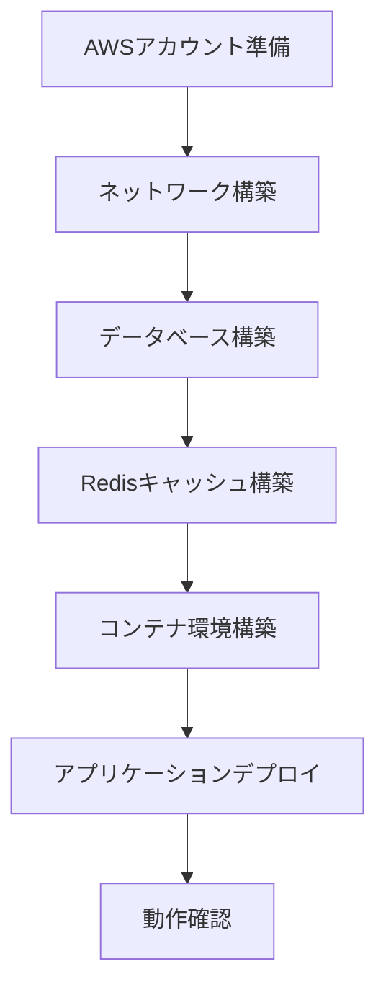
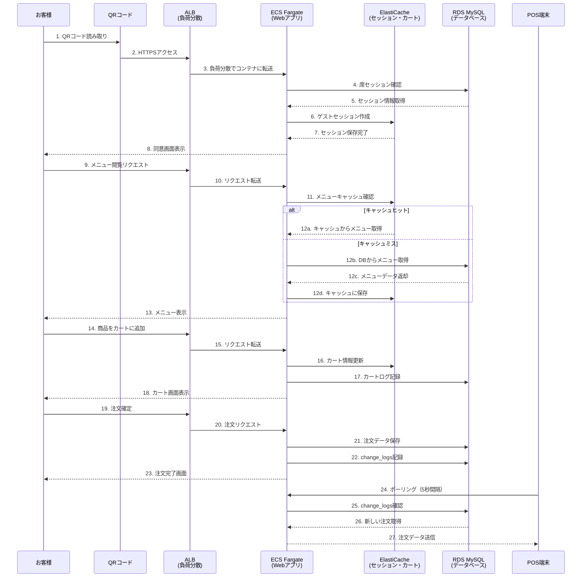
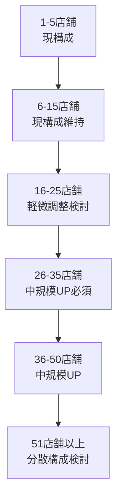

# AWS ECS Fargate 構築手順書（初心者向け詳細ガイド）
Mobile Order System - インフラ非専門スタッフでも理解できる構築手順

## 📋 このガイドについて

### 💡 対象者
- プログラマー（インフラ経験が少ない方）
- プロジェクトマネージャー
- システム管理者（AWS初心者）

### 📖 読み方
- **🚩 重要**: 必ず実行が必要な箇所
- **💡 解説**: 技術的な背景説明
- **⚠️ 注意**: 間違えやすいポイント
- **📝 確認**: 正しく設定できているかのチェック

### ⏰ 所要時間
- **準備作業**: 30分
- **基盤構築**: 2時間
- **アプリ設定**: 1時間
- **動作確認**: 30分
- **合計**: 約4時間

## 🎯 全体の流れ



## 🔄 Mobile Order Systemでの実際の処理フロー

### 📱 お客様の注文フローとAWSサービス



### 🏪 各AWSサービスの役割と活躍場面

#### 1. **Route 53（DNS管理）** 🌐
**システムフローでの役割:**
- お客様が「https://order.your-restaurant.com」にアクセス
- ドメイン名をALBのIPアドレスに変換

**具体的な処理:**
```
お客様のブラウザ → 「order.your-restaurant.com にアクセス」
Route 53 → 「それは 52.XXX.XXX.XXX のALBですよ」
ブラウザ → ALBに接続
```

#### 2. **ALB（Application Load Balancer）** ⚖️
**システムフローでの役割:**
- 複数のECSコンテナに負荷分散
- HTTPS/SSL終端（暗号化通信の処理）
- ヘルスチェックで故障コンテナを自動除外

**具体的な処理:**
```
📱 お客様A → ALB → ECSコンテナ1（席1のQRコード処理）
📱 お客様B → ALB → ECSコンテナ2（席2のメニュー表示）
💻 管理者   → ALB → ECSコンテナ1（管理画面アクセス）
🏪 POS端末 → ALB → ECSコンテナ2（注文データ取得）
```

#### 3. **ECS Fargate（Webアプリケーション）** 🐳
**システムフローでの役割:**
- Laravel アプリケーションの実行環境
- 自動スケーリングで負荷に応じてコンテナ数を調整
- 障害時の自動復旧

**具体的な処理:**
```
通常時: 2コンテナで運用
　├─ コンテナ1: お客様の注文処理
　└─ コンテナ2: POS連携・管理画面

ランチタイム（高負荷）: 4コンテナに自動拡張
　├─ コンテナ1: テーブル1-10の注文
　├─ コンテナ2: テーブル11-20の注文  
　├─ コンテナ3: POS連携処理
　└─ コンテナ4: 管理者の商品管理
```

#### 4. **RDS MySQL（メインデータベース）** 🗄️
**システムフローでの役割:**
- 全ての永続データを保存
- 自動バックアップで障害時の復旧に対応
- change_logsテーブルでPOS連携の要

**具体的な処理:**
```
🔄 リアルタイム処理:
- guest_sessions: ゲスト認証情報
- sessions: QRコードの席情報
- orders: 注文データ
- cart_logs: カート操作履歴
- change_logs: POS同期用データ

📊 マスターデータ:
- products: 商品情報
- categories: カテゴリ情報
- stores: 店舗情報
- users: 管理者情報
```

#### 5. **ElastiCache Redis（高速キャッシュ）** ⚡
**システムフローでの役割:**
- セッション状態を高速管理
- カート情報を瞬時に更新
- メニューデータをキャッシュして表示を高速化

**具体的な処理:**
```
🚀 Redis DB0（セッション管理）:
laravel_session:abc123 → お客様Aのセッション状態
laravel_session:def456 → お客様Bのセッション状態

🛒 Redis DB2（カート管理）:
guest_cart:token_abc → お客様Aのカート（ラーメン×2、チャーシュー×1）
guest_cart:token_def → お客様Bのカート（寿司セット×1）

📋 Redis DB1（メニューキャッシュ）:
menu:store_1:ja → 店舗1の日本語メニュー（30分キャッシュ）
menu:store_1:en → 店舗1の英語メニュー（30分キャッシュ）
```

#### 6. **Secrets Manager（機密情報管理）** 🔐
**システムフローでの役割:**
- データベースパスワードを暗号化保存
- アプリケーション起動時に安全に認証情報を提供
- パスワード変更の自動化

**具体的な処理:**
```
🔐 起動時の認証フロー:
ECS起動 → Secrets Manager → DB認証情報取得 → RDS接続

📝 保存されている機密情報:
mobile-order/database → RDS接続情報
mobile-order/app → Laravel APP_KEY
mobile-order/redis → Redis接続情報
mobile-order/pos-api → POS連携用APIキー
```

#### 7. **CloudWatch（監視・ログ）** 👁️
**システムフローでの役割:**
- システム異常の自動検知とアラート
- アクセスログやエラーログの収集・分析
- パフォーマンス監視とボトルネック特定

**具体的な処理:**
```
📊 リアルタイム監視:
CPU使用率 > 80% → Slack/メール通知 → 自動スケーリング
メモリ使用率 > 90% → アラート通知
RDS接続数 > 80 → DBA担当者に通知

📋 ログ分析:
/ecs/mobile-order/app → Laravel エラーログ
/ecs/mobile-order/nginx → アクセスログ
→ 「14:30に注文エラー急増」「どのテーブルで問題？」
```

#### 8. **ECR（Dockerイメージ管理）** 📦
**システムフローでの役割:**
- アプリケーションのバージョン管理
- デプロイ時の新旧イメージ切り替え
- セキュリティスキャン

**具体的な処理:**
```
🚀 デプロイフロー:
1. 開発者がコード更新
2. GitHub Actions → Dockerイメージビルド
3. ECR → 新バージョンイメージ保存（v1.2.0）
4. ECS → 新イメージでコンテナ再起動
5. 古いバージョン（v1.1.0）は自動削除

🔍 バージョン管理:
mobile-order/app:v1.2.0 ← 最新版（本番運用中）
mobile-order/app:v1.1.0 ← 前バージョン（ロールバック用）
mobile-order/nginx:latest ← 安定版
```

### 🔄 特徴的なシステムフロー別解説

#### A. **QRコード読み取り〜注文開始**
```
お客様がQRコードを読み取る
↓
ALB：HTTPSリクエストを適切なECSコンテナに転送
↓
ECS：席セッション情報をRDSから取得
↓
Redis：新しいゲストセッションを作成・保存
↓
お客様：ハンドルキーパー同意画面が表示される
```

#### B. **メニュー表示の高速化**
```
お客様がメニューページアクセス
↓
ECS：まずRedisのメニューキャッシュを確認
↓
【キャッシュヒット】Redis：瞬時にメニュー情報を返却
【キャッシュミス】RDS → データ取得 → Redis → キャッシュ保存
↓
お客様：0.5秒以内でメニューが表示される
```

#### C. **注文確定とPOS連携**
```
お客様が注文ボタンを押す
↓
ECS：注文データをRDSに保存
↓
RDS：change_logsテーブルに変更履歴を記録
↓
POS端末：5秒間隔でポーリング → 新しい注文を検知
↓
厨房：注文票が自動印刷される
```

#### D. **障害発生時の自動復旧**
```
ECSコンテナ1が突然停止
↓
ALB：ヘルスチェックで異常を検知（30秒以内）
↓
ALB：正常なコンテナ2のみにトラフィック転送
↓
ECS：Auto Recoveryで新しいコンテナを起動
↓
システム：ユーザーは障害に気づかずに利用継続
```

### 📈 負荷状況別のシステム動作

#### 🕐 平常時（同時5名利用）
```
ALB → ECS（2コンテナ）で十分対応
Redis → セッション5個、カート2-3個を管理
RDS → 軽微な読み書き処理
月額費用：約19,000円
```

#### 🍜 ランチタイム（同時40名利用）
```
ALB → ECS（4コンテナに自動拡張）
Redis → セッション40個、カート20個を高速処理
RDS → 注文ピーク時の書き込み集中に対応
月額費用：約25,000円（ピーク時間のみ）
```

#### 🚨 障害発生時
```
POS障害：オンプレ単独運用に切り替え（顧客影響なし）
クラウド障害：change_logsで復旧後に自動同期
データ喪失：RDS自動バックアップから復旧（RTO: 1時間）
```

この構成により、**お客様の快適な注文体験**と**店舗の効率的な運営**、そして**システムの安定稼働**を同時に実現できます！

---

## 🏪 マルチドメイン運用時の店舗数上限分析

### 📊 現アーキテクチャでの処理能力

現在の構成での各リソースと店舗数の関係：

| リソース | 1店舗あたり消費 | 上限値 | 対応可能店舗数 |
|---------|----------------|--------|----------------|
| **ECS CPU** | 10% (中規模店舗) | 0.5vCPU | **50店舗** |
| **ECS メモリ** | 50MB | 1GB | **20店舗** ⚠️ |
| **RDS接続数** | 5接続 | 100接続 | **20店舗** ⚠️ |
| **Redis メモリ** | 20MB | 0.5GB | **25店舗** |
| **ALB** | 40同時接続 | 無制限 | **無制限** |

**🚨 ボトルネック: ECSメモリとRDS接続数 → 理論上限20店舗**

### 🏪 店舗規模別の対応可能数

#### **小規模店舗（20席以下）の場合**
```
同時利用者: 平均10名、ピーク20名
リソース消費: CPU 5%, メモリ30MB, DB接続3個

→ 対応可能: 約30店舗
```

#### **中規模店舗（40席）の場合**
```
同時利用者: 平均20名、ピーク40名
リソース消費: CPU 10%, メモリ50MB, DB接続5個

→ 対応可能: 約20店舗
```

#### **大規模店舗（80席以上）の場合**
```
同時利用者: 平均40名、ピーク80名
リソース消費: CPU 20%, メモリ80MB, DB接続8個

→ 対応可能: 約10店舗
```

### ✅ 推奨運用店舗数

#### **安全運用範囲**
- **小規模中心**: 15-20店舗
- **中規模中心**: 10-15店舗
- **大規模中心**: 5-8店舗
- **混在型**: 12-15店舗

#### **最大チャレンジ範囲**
- **理論最大**: 30店舗（小規模のみ・リスクあり）
- **実用最大**: 25店舗（監視強化必須）

### 📈 スケールアップオプション

#### **Phase 1: 軽微調整（15→30店舗対応）**
```yaml
変更内容:
- ECS: メモリ 1GB → 2GB
- Redis: t4g.micro → t4g.small

追加月額費用: +約3,000円
対応店舗数: 30店舗
1店舗あたり追加コスト: 100円
```

#### **Phase 2: 中規模アップグレード（30→50店舗対応）**
```yaml
変更内容:
- ECS: 0.5vCPU → 1vCPU, 2GB → 4GB
- RDS: t3.micro → t3.small
- Redis: t4g.small → t4g.medium

追加月額費用: +約8,000円  
対応店舗数: 50店舗
1店舗あたり追加コスト: 160円
```

#### **Phase 3: 大規模構成（50→100店舗対応）**
```yaml
変更内容:
- ECS: 2vCPU, 4GB, タスク数4個
- RDS: t3.medium + Read Replica
- Redis: Cluster構成

追加月額費用: +約20,000円
対応店舗数: 100店舗
1店舗あたり追加コスト: 200円
```

### 🚨 監視指標と警告ライン

#### **15店舗以下（安全域・緑）**
- CPU使用率: <50%
- メモリ使用率: <60%
- RDS接続数: <60個
- **監視**: 週次確認でOK

#### **16-25店舗（要注意域・黄）**
- CPU使用率: 50-70%
- メモリ使用率: 60-80%
- RDS接続数: 60-85個
- **監視**: 日次確認が必要

#### **26店舗以上（危険域・赤）**
- CPU使用率: >70%
- メモリ使用率: >80%
- RDS接続数: >85個
- **監視**: リアルタイム監視必須

### 💰 店舗数別コスト効率

| 店舗数 | 月額費用 | 1店舗あたり | 構成 |
|-------|---------|-------------|------|
| 5店舗 | 20,000円 | 4,000円 | 現構成 |
| 15店舗 | 20,000円 | 1,333円 | 現構成 |
| 25店舗 | 23,000円 | 920円 | 軽微UP |
| 35店舗 | 28,000円 | 800円 | 中規模UP |
| 50店舗 | 28,000円 | 560円 | 中規模UP |

**最もコスト効率が良いのは50店舗運用時**

### 🔄 段階的拡張戦略



### 📋 店舗数拡張チェックリスト

#### **15店舗に近づいた時**
- [ ] CloudWatch監視の日次確認開始
- [ ] CPU/メモリ使用率の傾向分析
- [ ] RDS接続数の監視強化
- [ ] スケールアップ計画の準備

#### **20店舗を超える時**
- [ ] ECSメモリ増量の実施
- [ ] Redis インスタンスアップグレード
- [ ] リアルタイム監視アラートの設定
- [ ] 障害時対応手順の見直し

#### **25店舗を超える時**
- [ ] RDS スケールアップの実施
- [ ] ECS CPU増量の検討
- [ ] 分散構成への移行計画策定
- [ ] パフォーマンステストの実施

### 🎯 結論と推奨事項

#### **現アーキテクチャでの推奨上限**
- **安全運用**: **15店舗**
- **最大運用**: **25店舗**（要監視強化）

#### **拡張時の基本方針**
1. **15店舗まで**: 現構成で安全運用
2. **16-25店舗**: 軽微なスケールアップで対応
3. **26店舗以上**: 本格的なアーキテクチャ見直し

**Mobile Order Systemでは15店舗が最適なバランスポイント**です。これ以上の拡張は段階的なインフラ強化により実現可能です。

---

## Phase 1: 事前準備（30分）

### 🚩 Step 1-1: AWSアカウント設定

#### 💡 解説：AWSアカウントとは
AWSは「Amazon Web Services」の略で、Amazonが提供するクラウドサービスです。サーバーやデータベースを物理的に購入する代わりに、インターネット経由で利用できます。

#### 📝 必要な準備
1. **AWSアカウント作成**
   ```
   https://aws.amazon.com/ にアクセス
   → 「今すぐ始める」をクリック
   → メールアドレス・パスワード・クレジットカード情報を入力
   ```

2. **IAMユーザー作成**（セキュリティ強化のため）
   ```
   💡 解説：IAMユーザーとは
   ルートアカウント（最高権限）の代わりに使う、権限制限されたユーザーです。
   セキュリティの観点から、日常的にはIAMユーザーを使用します。
   
   📝 手順：
   1. AWSコンソール → IAM → ユーザー → 「ユーザーを追加」
   2. ユーザー名: mobile-order-admin
   3. アクセスの種類: プログラムによるアクセス + AWSマネジメントコンソールへのアクセス
   4. 既存のポリシーを直接アタッチ → AdministratorAccess
   5. アクセスキー・シークレットキーをメモ（後で使用）
   ```

### 🚩 Step 1-2: 必要ツールのインストール

#### AWS CLI（AWSをコマンドラインから操作するツール）
```bash
# Windows（PowerShell）
msiexec.exe /i https://awscli.amazonaws.com/AWSCLIV2.msi

# Mac
curl "https://awscli.amazonaws.com/AWSCLIV2.pkg" -o "AWSCLIV2.pkg"
sudo installer -pkg AWSCLIV2.pkg -target /

# Linux
curl "https://awscli.amazonaws.com/awscli-exe-linux-x86_64.zip" -o "awscliv2.zip"
unzip awscliv2.zip
sudo ./aws/install
```

#### AWS CLIの設定
```bash
aws configure
# AWS Access Key ID: （Step 1-1でメモしたアクセスキー）
# AWS Secret Access Key: （Step 1-1でメモしたシークレットキー）
# Default region name: ap-northeast-1  # 東京リージョン
# Default output format: json
```

### 📝 確認: 準備完了チェック
```bash
# 以下のコマンドでエラーが出なければOK
aws sts get-caller-identity
```

---

## Phase 2: ネットワーク基盤構築（45分）

### 💡 解説：VPCとは
VPC（Virtual Private Cloud）は、AWS上に作成する仮想的なネットワーク環境です。自分専用のネットワーク空間で、外部からの不正アクセスを防ぎます。

### 🚩 Step 2-1: VPC作成

```bash
# VPCを作成（10.0.0.0/16 = 65,536個のIPアドレスを使える範囲）
aws ec2 create-vpc \
    --cidr-block 10.0.0.0/16 \
    --tag-specifications 'ResourceType=vpc,Tags=[{Key=Name,Value=mobile-order-vpc}]'
```

**📝 実行後の確認:**
```bash
# VPCが作成されたか確認
aws ec2 describe-vpcs --filters "Name=tag:Name,Values=mobile-order-vpc"
```

### 🚩 Step 2-2: サブネット作成

#### 💡 解説：サブネットとは
VPCをさらに細かく分割した単位です。用途や場所別に分けることで、セキュリティと可用性を向上させます。

```bash
# VPC IDを環境変数に保存（後の作業で使い回すため）
VPC_ID=$(aws ec2 describe-vpcs --filters "Name=tag:Name,Values=mobile-order-vpc" --query "Vpcs[0].VpcId" --output text)

# パブリックサブネット（インターネットからアクセス可能）
# ALB（ロードバランサー）を配置する場所
aws ec2 create-subnet \
    --vpc-id $VPC_ID \
    --cidr-block 10.0.1.0/24 \
    --availability-zone ap-northeast-1a \
    --tag-specifications 'ResourceType=subnet,Tags=[{Key=Name,Value=mobile-order-public-1a}]'

aws ec2 create-subnet \
    --vpc-id $VPC_ID \
    --cidr-block 10.0.2.0/24 \
    --availability-zone ap-northeast-1c \
    --tag-specifications 'ResourceType=subnet,Tags=[{Key=Name,Value=mobile-order-public-1c}]'

# プライベートサブネット（内部からのみアクセス可能）
# アプリケーション（ECS）を配置する場所
aws ec2 create-subnet \
    --vpc-id $VPC_ID \
    --cidr-block 10.0.11.0/24 \
    --availability-zone ap-northeast-1a \
    --tag-specifications 'ResourceType=subnet,Tags=[{Key=Name,Value=mobile-order-private-1a}]'

aws ec2 create-subnet \
    --vpc-id $VPC_ID \
    --cidr-block 10.0.12.0/24 \
    --availability-zone ap-northeast-1c \
    --tag-specifications 'ResourceType=subnet,Tags=[{Key=Name,Value=mobile-order-private-1c}]'

# データベース専用サブネット
# RDSとElastiCacheを配置する場所
aws ec2 create-subnet \
    --vpc-id $VPC_ID \
    --cidr-block 10.0.21.0/24 \
    --availability-zone ap-northeast-1a \
    --tag-specifications 'ResourceType=subnet,Tags=[{Key=Name,Value=mobile-order-db-1a}]'

aws ec2 create-subnet \
    --vpc-id $VPC_ID \
    --cidr-block 10.0.22.0/24 \
    --availability-zone ap-northeast-1c \
    --tag-specifications 'ResourceType=subnet,Tags=[{Key=Name,Value=mobile-order-db-1c}]'
```

### 🚩 Step 2-3: インターネットゲートウェイ作成

#### 💡 解説：インターネットゲートウェイとは
VPCとインターネットを繋ぐ出入り口です。これがないとインターネットからアクセスできません。

```bash
# インターネットゲートウェイ作成
aws ec2 create-internet-gateway \
    --tag-specifications 'ResourceType=internet-gateway,Tags=[{Key=Name,Value=mobile-order-igw}]'

# VPCにアタッチ
IGW_ID=$(aws ec2 describe-internet-gateways --filters "Name=tag:Name,Values=mobile-order-igw" --query "InternetGateways[0].InternetGatewayId" --output text)

aws ec2 attach-internet-gateway \
    --vpc-id $VPC_ID \
    --internet-gateway-id $IGW_ID
```

### 🚩 Step 2-4: ルートテーブル設定

#### 💡 解説：ルートテーブルとは
ネットワークの通り道を決める設定です。「どのIPアドレスはどこに向かうか」を定義します。

```bash
# パブリック用ルートテーブル作成
aws ec2 create-route-table \
    --vpc-id $VPC_ID \
    --tag-specifications 'ResourceType=route-table,Tags=[{Key=Name,Value=mobile-order-public-rt}]'

PUBLIC_RT_ID=$(aws ec2 describe-route-tables --filters "Name=tag:Name,Values=mobile-order-public-rt" --query "RouteTables[0].RouteTableId" --output text)

# インターネットへのルート追加
aws ec2 create-route \
    --route-table-id $PUBLIC_RT_ID \
    --destination-cidr-block 0.0.0.0/0 \
    --gateway-id $IGW_ID

# パブリックサブネットをルートテーブルに関連付け
PUBLIC_SUBNET_1A=$(aws ec2 describe-subnets --filters "Name=tag:Name,Values=mobile-order-public-1a" --query "Subnets[0].SubnetId" --output text)
PUBLIC_SUBNET_1C=$(aws ec2 describe-subnets --filters "Name=tag:Name,Values=mobile-order-public-1c" --query "Subnets[0].SubnetId" --output text)

aws ec2 associate-route-table --subnet-id $PUBLIC_SUBNET_1A --route-table-id $PUBLIC_RT_ID
aws ec2 associate-route-table --subnet-id $PUBLIC_SUBNET_1C --route-table-id $PUBLIC_RT_ID
```

### 📝 確認: ネットワーク構築完了チェック
```bash
# VPCとサブネットが作成されているか確認
aws ec2 describe-vpcs --filters "Name=tag:Name,Values=mobile-order-vpc"
aws ec2 describe-subnets --filters "Name=vpc-id,Values=$VPC_ID"
```

---

## Phase 3: データベース構築（45分）

### 💡 解説：RDSとは
RDS（Relational Database Service）は、AWSが管理するデータベースサービスです。バックアップやメンテナンスが自動で行われるため、運用負荷が軽減されます。

### 🚩 Step 3-1: データベースサブネットグループ作成

#### 💡 解説：サブネットグループとは
RDSを配置するサブネットの組み合わせです。障害時の冗長性のため、複数のアベイラビリティゾーンに分散させます。

```bash
# サブネットIDを取得
DB_SUBNET_1A=$(aws ec2 describe-subnets --filters "Name=tag:Name,Values=mobile-order-db-1a" --query "Subnets[0].SubnetId" --output text)
DB_SUBNET_1C=$(aws ec2 describe-subnets --filters "Name=tag:Name,Values=mobile-order-db-1c" --query "Subnets[0].SubnetId" --output text)

# サブネットグループ作成
aws rds create-db-subnet-group \
    --db-subnet-group-name mobile-order-db-subnet-group \
    --db-subnet-group-description "Mobile Order Database Subnet Group" \
    --subnet-ids $DB_SUBNET_1A $DB_SUBNET_1C \
    --tags Key=Name,Value=mobile-order-db-subnet-group
```

### 🚩 Step 3-2: セキュリティグループ作成

#### 💡 解説：セキュリティグループとは
ファイアウォールの役割を果たします。「どのIPアドレスから、どのポートへのアクセスを許可するか」を設定します。

```bash
# RDS用セキュリティグループ作成
aws ec2 create-security-group \
    --group-name mobile-order-rds-sg \
    --description "Security group for Mobile Order RDS" \
    --vpc-id $VPC_ID \
    --tag-specifications 'ResourceType=security-group,Tags=[{Key=Name,Value=mobile-order-rds-sg}]'

RDS_SG_ID=$(aws ec2 describe-security-groups --filters "Name=tag:Name,Values=mobile-order-rds-sg" --query "SecurityGroups[0].GroupId" --output text)

# MySQL（3306番ポート）へのアクセスを、プライベートサブネットからのみ許可
aws ec2 authorize-security-group-ingress \
    --group-id $RDS_SG_ID \
    --protocol tcp \
    --port 3306 \
    --cidr 10.0.11.0/24  # プライベートサブネット1a

aws ec2 authorize-security-group-ingress \
    --group-id $RDS_SG_ID \
    --protocol tcp \
    --port 3306 \
    --cidr 10.0.12.0/24  # プライベートサブネット1c
```

### 🚩 Step 3-3: RDS MySQL作成

```bash
# ⚠️ 注意：パスワードは必ず変更してください
aws rds create-db-instance \
    --db-instance-identifier mobile-order-db \
    --db-instance-class db.t3.micro \
    --engine mysql \
    --engine-version 8.0.35 \
    --master-username root \
    --master-user-password "ChangeThisPassword123!" \
    --allocated-storage 20 \
    --storage-type gp3 \
    --db-subnet-group-name mobile-order-db-subnet-group \
    --vpc-security-group-ids $RDS_SG_ID \
    --backup-retention-period 7 \
    --storage-encrypted \
    --enable-performance-insights \
    --performance-insights-retention-period 7 \
    --tags Key=Name,Value=mobile-order-db
```

#### 💡 解説：設定内容
- **db.t3.micro**: 最小スペック（1vCPU, 1GB RAM）
- **gp3**: 最新の高性能ストレージ
- **backup-retention-period 7**: 7日間バックアップ保持
- **storage-encrypted**: 暗号化有効

### 📝 確認: RDS作成状況チェック
```bash
# RDSの作成状況確認（10-15分かかります）
aws rds describe-db-instances --db-instance-identifier mobile-order-db --query "DBInstances[0].DBInstanceStatus"
```

---

## Phase 4: Redisキャッシュ構築（30分）

### 💡 解説：ElastiCacheとは
Redisというキャッシュシステムをマネージドサービスとして提供します。セッション情報やカート情報を高速で処理できます。

### 🚩 Step 4-1: ElastiCache用セキュリティグループ作成

```bash
# ElastiCache用セキュリティグループ作成
aws ec2 create-security-group \
    --group-name mobile-order-redis-sg \
    --description "Security group for Mobile Order Redis" \
    --vpc-id $VPC_ID \
    --tag-specifications 'ResourceType=security-group,Tags=[{Key=Name,Value=mobile-order-redis-sg}]'

REDIS_SG_ID=$(aws ec2 describe-security-groups --filters "Name=tag:Name,Values=mobile-order-redis-sg" --query "SecurityGroups[0].GroupId" --output text)

# Redis（6379番ポート）へのアクセスを、プライベートサブネットからのみ許可
aws ec2 authorize-security-group-ingress \
    --group-id $REDIS_SG_ID \
    --protocol tcp \
    --port 6379 \
    --cidr 10.0.11.0/24

aws ec2 authorize-security-group-ingress \
    --group-id $REDIS_SG_ID \
    --protocol tcp \
    --port 6379 \
    --cidr 10.0.12.0/24
```

### 🚩 Step 4-2: ElastiCacheサブネットグループ作成

```bash
# ElastiCache用サブネットグループ作成
aws elasticache create-cache-subnet-group \
    --cache-subnet-group-name mobile-order-redis-subnet-group \
    --cache-subnet-group-description "Mobile Order Redis Subnet Group" \
    --subnet-ids $DB_SUBNET_1A $DB_SUBNET_1C
```

### 🚩 Step 4-3: ElastiCache Redis作成

```bash
# Redis クラスター作成
aws elasticache create-cache-cluster \
    --cache-cluster-id mobile-order-redis \
    --cache-node-type cache.t4g.micro \
    --engine redis \
    --engine-version 7.0 \
    --num-cache-nodes 1 \
    --cache-subnet-group-name mobile-order-redis-subnet-group \
    --security-group-ids $REDIS_SG_ID \
    --tags Key=Name,Value=mobile-order-redis
```

### 📝 確認: ElastiCache作成状況チェック
```bash
# ElastiCacheの作成状況確認（5-10分かかります）
aws elasticache describe-cache-clusters --cache-cluster-id mobile-order-redis --query "CacheClusters[0].CacheClusterStatus"
```

---

## Phase 5: コンテナ環境構築（60分）

### 💡 解説：ECSとは
ECS（Elastic Container Service）は、Dockerコンテナを簡単に実行・管理できるサービスです。アプリケーションをコンテナ化することで、環境の違いによる問題を防げます。

### 🚩 Step 5-1: ECRリポジトリ作成

#### 💡 解説：ECRとは
ECR（Elastic Container Registry）は、Dockerイメージを保存する場所です。GitHubのようなバージョン管理をDockerイメージで行います。

```bash
# アプリケーション用リポジトリ作成
aws ecr create-repository \
    --repository-name mobile-order/app \
    --image-scanning-configuration scanOnPush=true \
    --tags Key=Name,Value=mobile-order-app

# Nginx用リポジトリ作成
aws ecr create-repository \
    --repository-name mobile-order/nginx \
    --image-scanning-configuration scanOnPush=true \
    --tags Key=Name,Value=mobile-order-nginx
```

### 🚩 Step 5-2: ECSクラスター作成

```bash
# ECSクラスター作成
aws ecs create-cluster \
    --cluster-name mobile-order-cluster \
    --capacity-providers FARGATE \
    --default-capacity-provider-strategy capacityProvider=FARGATE,weight=1 \
    --settings name=containerInsights,value=enabled \
    --tags key=Name,value=mobile-order-cluster
```

### 🚩 Step 5-3: ECS用セキュリティグループ作成

```bash
# ECS用セキュリティグループ作成
aws ec2 create-security-group \
    --group-name mobile-order-ecs-sg \
    --description "Security group for Mobile Order ECS" \
    --vpc-id $VPC_ID \
    --tag-specifications 'ResourceType=security-group,Tags=[{Key=Name,Value=mobile-order-ecs-sg}]'

ECS_SG_ID=$(aws ec2 describe-security-group --filters "Name=tag:Name,Values=mobile-order-ecs-sg" --query "SecurityGroups[0].GroupId" --output text)

# HTTP（80番ポート）へのアクセスを許可
aws ec2 authorize-security-group-ingress \
    --group-id $ECS_SG_ID \
    --protocol tcp \
    --port 80 \
    --cidr 0.0.0.0/0

# HTTPS（443番ポート）へのアクセスを許可
aws ec2 authorize-security-group-ingress \
    --group-id $ECS_SG_ID \
    --protocol tcp \
    --port 443 \
    --cidr 0.0.0.0/0
```

### 🚩 Step 5-4: ALB（ロードバランサー）作成

#### 💡 解説：ALBとは
ALB（Application Load Balancer）は、複数のサーバーに負荷を分散する装置です。1台のサーバーがダウンしても、他のサーバーで処理を続行できます。

```bash
# ALB用セキュリティグループ作成
aws ec2 create-security-group \
    --group-name mobile-order-alb-sg \
    --description "Security group for Mobile Order ALB" \
    --vpc-id $VPC_ID \
    --tag-specifications 'ResourceType=security-group,Tags=[{Key=Name,Value=mobile-order-alb-sg}]'

ALB_SG_ID=$(aws ec2 describe-security-groups --filters "Name=tag:Name,Values=mobile-order-alb-sg" --query "SecurityGroups[0].GroupId" --output text)

# HTTP/HTTPSアクセス許可
aws ec2 authorize-security-group-ingress --group-id $ALB_SG_ID --protocol tcp --port 80 --cidr 0.0.0.0/0
aws ec2 authorize-security-group-ingress --group-id $ALB_SG_ID --protocol tcp --port 443 --cidr 0.0.0.0/0

# ALB作成
aws elbv2 create-load-balancer \
    --name mobile-order-alb \
    --subnets $PUBLIC_SUBNET_1A $PUBLIC_SUBNET_1C \
    --security-groups $ALB_SG_ID \
    --tags Key=Name,Value=mobile-order-alb
```

### 📝 確認: ここまでの進捗チェック
```bash
# 作成されたリソースを確認
echo "=== ECRリポジトリ ==="
aws ecr describe-repositories --query "repositories[].repositoryName"

echo "=== ECSクラスター ==="
aws ecs describe-clusters --clusters mobile-order-cluster --query "clusters[0].status"

echo "=== ALB ==="
aws elbv2 describe-load-balancers --names mobile-order-alb --query "LoadBalancers[0].State.Code"
```

---

## Phase 6: 機密情報管理（15分）

### 💡 解説：Secrets Managerとは
データベースパスワードやAPIキーなどの機密情報を安全に保存・管理するサービスです。アプリケーションから参照する際も暗号化されています。

### 🚩 Step 6-1: データベース接続情報の保存

```bash
# RDSエンドポイント取得
RDS_ENDPOINT=$(aws rds describe-db-instances --db-instance-identifier mobile-order-db --query "DBInstances[0].Endpoint.Address" --output text)

# データベース接続情報をSecrets Managerに保存
aws secretsmanager create-secret \
    --name mobile-order/database \
    --description "Mobile Order Database Credentials" \
    --secret-string "{\"username\":\"root\",\"password\":\"ChangeThisPassword123!\",\"host\":\"$RDS_ENDPOINT\",\"port\":3306,\"dbname\":\"mobile_order\"}"
```

### 🚩 Step 6-2: アプリケーション設定の保存

```bash
# Laravel アプリケーションキー生成（32文字のランダム文字列）
APP_KEY=$(openssl rand -base64 32)

# アプリケーション設定をSecrets Managerに保存
aws secretsmanager create-secret \
    --name mobile-order/app \
    --description "Mobile Order Application Settings" \
    --secret-string "{\"app_key\":\"base64:$APP_KEY\",\"app_env\":\"production\",\"app_debug\":\"false\"}"

# Redis接続情報取得・保存
REDIS_ENDPOINT=$(aws elasticache describe-cache-clusters --cache-cluster-id mobile-order-redis --show-cache-node-info --query "CacheClusters[0].CacheNodes[0].Endpoint.Address" --output text)

aws secretsmanager create-secret \
    --name mobile-order/redis \
    --description "Mobile Order Redis Connection" \
    --secret-string "{\"host\":\"$REDIS_ENDPOINT\",\"port\":6379}"
```

---

## Phase 7: アプリケーションデプロイ（60分）

### 💡 解説：このフェーズでやること
作成したインフラ上に、実際のMobile Order Systemアプリケーションを配置し、動作するように設定します。

### 🚩 Step 7-1: IAMロール作成

#### 💡 解説：IAMロールとは
AWSサービス同士が連携する際の権限設定です。例えば「ECSがECRからDockerイメージを取得する」際に必要です。

```bash
# ECSタスク実行ロール用のポリシードキュメント作成
cat << 'EOF' > ecs-trust-policy.json
{
  "Version": "2012-10-17",
  "Statement": [
    {
      "Effect": "Allow",
      "Principal": {
        "Service": "ecs-tasks.amazonaws.com"
      },
      "Action": "sts:AssumeRole"
    }
  ]
}
EOF

# ECSタスク実行ロール作成
aws iam create-role \
    --role-name mobile-order-ecs-execution-role \
    --assume-role-policy-document file://ecs-trust-policy.json \
    --tags Key=Name,Value=mobile-order-ecs-execution-role

# ECSタスクロール作成（アプリケーションが使用）
aws iam create-role \
    --role-name mobile-order-ecs-task-role \
    --assume-role-policy-document file://ecs-trust-policy.json \
    --tags Key=Name,Value=mobile-order-ecs-task-role

# 必要なポリシーをアタッチ
aws iam attach-role-policy \
    --role-name mobile-order-ecs-execution-role \
    --policy-arn arn:aws:iam::aws:policy/service-role/AmazonECSTaskExecutionRolePolicy

# Secrets Manager読み取り権限
aws iam attach-role-policy \
    --role-name mobile-order-ecs-execution-role \
    --policy-arn arn:aws:iam::aws:policy/SecretsManagerReadWrite

# S3アクセス権限
aws iam attach-role-policy \
    --role-name mobile-order-ecs-task-role \
    --policy-arn arn:aws:iam::aws:policy/AmazonS3FullAccess
```

### 🚩 Step 7-2: Dockerイメージの準備

#### ⚠️ 注意：この手順では簡易版を使用
実際の本番環境では、プロジェクトのソースコードからDockerイメージを作成しますが、ここでは動作確認用の簡易版を使用します。

```bash
# ECRへのログイン
ACCOUNT_ID=$(aws sts get-caller-identity --query Account --output text)
aws ecr get-login-password --region ap-northeast-1 | docker login --username AWS --password-stdin $ACCOUNT_ID.dkr.ecr.ap-northeast-1.amazonaws.com

# 簡易版Dockerイメージをプル・タグ付け・プッシュ
# ※ 実際には mobile-order のソースコードからビルドします
docker pull nginx:alpine
docker tag nginx:alpine $ACCOUNT_ID.dkr.ecr.ap-northeast-1.amazonaws.com/mobile-order/nginx:latest
docker push $ACCOUNT_ID.dkr.ecr.ap-northeast-1.amazonaws.com/mobile-order/nginx:latest

# PHP（Laravel）のベースイメージをプッシュ
docker pull php:8.1-fpm-alpine
docker tag php:8.1-fpm-alpine $ACCOUNT_ID.dkr.ecr.ap-northeast-1.amazonaws.com/mobile-order/app:latest
docker push $ACCOUNT_ID.dkr.ecr.ap-northeast-1.amazonaws.com/mobile-order/app:latest
```

### 🚩 Step 7-3: タスク定義作成

#### 💡 解説：タスク定義とは
Dockerコンテナをどのように実行するかを定義するファイルです。使用するイメージ、メモリ、CPU、環境変数などを指定します。

```bash
# タスク定義用JSONファイル作成
cat << EOF > mobile-order-task-definition.json
{
  "family": "mobile-order-web",
  "networkMode": "awsvpc",
  "requiresCompatibilities": ["FARGATE"],
  "cpu": "512",
  "memory": "1024",
  "executionRoleArn": "arn:aws:iam::${ACCOUNT_ID}:role/mobile-order-ecs-execution-role",
  "taskRoleArn": "arn:aws:iam::${ACCOUNT_ID}:role/mobile-order-ecs-task-role",
  "containerDefinitions": [
    {
      "name": "nginx",
      "image": "${ACCOUNT_ID}.dkr.ecr.ap-northeast-1.amazonaws.com/mobile-order/nginx:latest",
      "cpu": 128,
      "memory": 256,
      "essential": true,
      "portMappings": [
        {
          "containerPort": 80,
          "protocol": "tcp"
        }
      ],
      "logConfiguration": {
        "logDriver": "awslogs",
        "options": {
          "awslogs-group": "/ecs/mobile-order/nginx",
          "awslogs-region": "ap-northeast-1",
          "awslogs-stream-prefix": "ecs"
        }
      }
    },
    {
      "name": "php-fpm",
      "image": "${ACCOUNT_ID}.dkr.ecr.ap-northeast-1.amazonaws.com/mobile-order/app:latest",
      "cpu": 384,
      "memory": 768,
      "essential": true,
      "environment": [
        {
          "name": "APP_ENV",
          "value": "production"
        }
      ],
      "secrets": [
        {
          "name": "DB_HOST",
          "valueFrom": "arn:aws:secretsmanager:ap-northeast-1:${ACCOUNT_ID}:secret:mobile-order/database:host::"
        },
        {
          "name": "DB_PASSWORD",
          "valueFrom": "arn:aws:secretsmanager:ap-northeast-1:${ACCOUNT_ID}:secret:mobile-order/database:password::"
        }
      ],
      "logConfiguration": {
        "logDriver": "awslogs",
        "options": {
          "awslogs-group": "/ecs/mobile-order/app",
          "awslogs-region": "ap-northeast-1",
          "awslogs-stream-prefix": "ecs"
        }
      }
    }
  ]
}
EOF

# 環境変数を実際の値に置換
envsubst < mobile-order-task-definition.json > mobile-order-task-definition-final.json

# タスク定義を登録
aws ecs register-task-definition \
    --cli-input-json file://mobile-order-task-definition-final.json
```

### 🚩 Step 7-4: CloudWatch Logsグループ作成

#### 💡 解説：CloudWatch Logsとは
アプリケーションのログを収集・保存・検索できるサービスです。問題発生時の調査に必須です。

```bash
# ロググループ作成
aws logs create-log-group --log-group-name /ecs/mobile-order/nginx
aws logs create-log-group --log-group-name /ecs/mobile-order/app

# ログ保持期間設定（30日間）
aws logs put-retention-policy --log-group-name /ecs/mobile-order/nginx --retention-in-days 30
aws logs put-retention-policy --log-group-name /ecs/mobile-order/app --retention-in-days 30
```

---

## Phase 8: サービス起動と動作確認（30分）

### 🚩 Step 8-1: ターゲットグループ作成

#### 💡 解説：ターゲットグループとは
ALBがトラフィックを振り分ける先のグループです。複数のコンテナインスタンスをまとめて管理します。

```bash
# ターゲットグループ作成
aws elbv2 create-target-group \
    --name mobile-order-tg \
    --protocol HTTP \
    --port 80 \
    --vpc-id $VPC_ID \
    --target-type ip \
    --health-check-path /health \
    --health-check-interval-seconds 30 \
    --health-check-timeout-seconds 5 \
    --healthy-threshold-count 2 \
    --unhealthy-threshold-count 3 \
    --tags Key=Name,Value=mobile-order-tg

# ターゲットグループARN取得
TG_ARN=$(aws elbv2 describe-target-groups --names mobile-order-tg --query "TargetGroups[0].TargetGroupArn" --output text)
```

### 🚩 Step 8-2: ALBリスナー作成

```bash
# ALBのARN取得
ALB_ARN=$(aws elbv2 describe-load-balancers --names mobile-order-alb --query "LoadBalancers[0].LoadBalancerArn" --output text)

# HTTPリスナー作成（本番環境ではHTTPSも設定）
aws elbv2 create-listener \
    --load-balancer-arn $ALB_ARN \
    --protocol HTTP \
    --port 80 \
    --default-actions Type=forward,TargetGroupArn=$TG_ARN
```

### 🚩 Step 8-3: ECSサービス作成・起動

```bash
# プライベートサブネットID取得
PRIVATE_SUBNET_1A=$(aws ec2 describe-subnets --filters "Name=tag:Name,Values=mobile-order-private-1a" --query "Subnets[0].SubnetId" --output text)
PRIVATE_SUBNET_1C=$(aws ec2 describe-subnets --filters "Name=tag:Name,Values=mobile-order-private-1c" --query "Subnets[0].SubnetId" --output text)

# ECSサービス作成
aws ecs create-service \
    --cluster mobile-order-cluster \
    --service-name mobile-order-web-service \
    --task-definition mobile-order-web \
    --desired-count 2 \
    --launch-type FARGATE \
    --network-configuration "awsvpcConfiguration={subnets=[$PRIVATE_SUBNET_1A,$PRIVATE_SUBNET_1C],securityGroups=[$ECS_SG_ID],assignPublicIp=ENABLED}" \
    --load-balancers targetGroupArn=$TG_ARN,containerName=nginx,containerPort=80 \
    --tags key=Name,value=mobile-order-web-service
```

### 📝 確認: サービス起動状況チェック

```bash
# サービス状態確認
aws ecs describe-services \
    --cluster mobile-order-cluster \
    --services mobile-order-web-service \
    --query "services[0].status"

# タスク状態確認
aws ecs list-tasks \
    --cluster mobile-order-cluster \
    --service-name mobile-order-web-service

# ALBのDNS名取得（ブラウザでアクセスする際に使用）
aws elbv2 describe-load-balancers \
    --names mobile-order-alb \
    --query "LoadBalancers[0].DNSName" \
    --output text
```

### 🚩 Step 8-4: 動作確認

```bash
# ALBのDNS名を使ってアクセステスト
ALB_DNS=$(aws elbv2 describe-load-balancers --names mobile-order-alb --query "LoadBalancers[0].DNSName" --output text)

echo "=== アクセステスト ==="
echo "ブラウザで以下のURLにアクセスしてください："
echo "http://$ALB_DNS"

# ヘルスチェック確認
curl -I http://$ALB_DNS/health
```

---

## 🎯 Phase 9: 最終確認とクリーンアップ設定

### 🚩 Step 9-1: 総合動作確認チェックリスト

```bash
echo "=== 構築完了チェックリスト ==="

echo "✅ 1. VPCとサブネット"
aws ec2 describe-vpcs --filters "Name=tag:Name,Values=mobile-order-vpc" --query "Vpcs[0].State"

echo "✅ 2. RDS MySQL"
aws rds describe-db-instances --db-instance-identifier mobile-order-db --query "DBInstances[0].DBInstanceStatus"

echo "✅ 3. ElastiCache Redis"
aws elasticache describe-cache-clusters --cache-cluster-id mobile-order-redis --query "CacheClusters[0].CacheClusterStatus"

echo "✅ 4. ECS クラスター"
aws ecs describe-clusters --clusters mobile-order-cluster --query "clusters[0].status"

echo "✅ 5. ECS サービス"
aws ecs describe-services --cluster mobile-order-cluster --services mobile-order-web-service --query "services[0].status"

echo "✅ 6. ALB"
aws elbv2 describe-load-balancers --names mobile-order-alb --query "LoadBalancers[0].State.Code"

echo "=== アクセス情報 ==="
echo "アプリケーションURL: http://$ALB_DNS"
echo "管理画面URL: http://$ALB_DNS/admin"
```

### 🚩 Step 9-2: 監視とアラート設定

#### 💡 解説：CloudWatchアラーム
システムの異常を自動的に検知し、メールやSlackで通知できます。

```bash
# CPU使用率が80%を超えたときのアラーム
aws cloudwatch put-metric-alarm \
    --alarm-name "mobile-order-ecs-cpu-high" \
    --alarm-description "ECS CPU utilization is too high" \
    --metric-name CPUUtilization \
    --namespace AWS/ECS \
    --statistic Average \
    --period 300 \
    --threshold 80 \
    --comparison-operator GreaterThanThreshold \
    --dimensions Name=ServiceName,Value=mobile-order-web-service Name=ClusterName,Value=mobile-order-cluster \
    --evaluation-periods 2

# RDS接続数アラーム
aws cloudwatch put-metric-alarm \
    --alarm-name "mobile-order-rds-connections-high" \
    --alarm-description "RDS connection count is too high" \
    --metric-name DatabaseConnections \
    --namespace AWS/RDS \
    --statistic Average \
    --period 300 \
    --threshold 80 \
    --comparison-operator GreaterThanThreshold \
    --dimensions Name=DBInstanceIdentifier,Value=mobile-order-db \
    --evaluation-periods 2
```

### 🚩 Step 9-3: バックアップ確認

```bash
echo "=== バックアップ設定確認 ==="

# RDS自動バックアップ確認
aws rds describe-db-instances \
    --db-instance-identifier mobile-order-db \
    --query "DBInstances[0].[BackupRetentionPeriod,PreferredBackupWindow]"

# CloudWatch Logsの保存期間確認
aws logs describe-log-groups \
    --log-group-name-prefix "/ecs/mobile-order/" \
    --query "logGroups[].[logGroupName,retentionInDays]"
```

---

## 💰 料金見積もりと最適化

### 📊 月額料金概算

| サービス | 構成 | 月額費用 |
|---------|------|----------|
| ECS Fargate | 0.5vCPU×1GB×2タスク×24時間 | 約8,000円 |
| RDS MySQL | db.t3.micro×24時間 | 約3,750円 |
| ElastiCache | cache.t4g.micro×24時間 | 約1,500円 |
| ALB | 1台×24時間 | 約3,125円 |
| データ転送 | 100GB/月 | 約1,250円 |
| CloudWatch | ログ+メトリクス | 約1,000円 |
| Secrets Manager | 5シークレット | 約625円 |
| **合計** | | **約19,250円/月** |

### 💡 コスト最適化のコツ

1. **開発環境の停止**
   ```bash
   # 夜間・週末は開発環境を停止
   aws rds stop-db-instance --db-instance-identifier mobile-order-dev-db
   ```

2. **Savings Plans活用**
   ```bash
   # 1年契約で20%削減、Mobile Order Systemの安定性確保
   # AWS管理コンソールから購入推奨
   ```

3. **CloudWatch Logsのライフサイクル**
   ```bash
   # 古いログの自動削除で容量削減
   aws logs put-retention-policy --log-group-name /ecs/mobile-order/app --retention-in-days 30
   ```

---

## 🔧 トラブルシューティング

### よくある問題と解決方法

#### 1. 「ECSタスクが起動しない」
```bash
# 原因確認
aws ecs describe-tasks --cluster mobile-order-cluster --tasks [タスクARN]

# よくある原因：
# - Dockerイメージが見つからない → ECRにプッシュされているか確認
# - メモリ不足 → タスク定義のメモリ設定を確認
# - セキュリティグループでブロック → ポート設定を確認
```

#### 2. 「ALBでヘルスチェックが失敗する」
```bash
# ヘルスチェック設定確認
aws elbv2 describe-target-health --target-group-arn $TG_ARN

# よくある原因：
# - /health エンドポイントが存在しない
# - アプリケーションが80番ポートでリッスンしていない
# - セキュリティグループの設定間違い
```

#### 3. 「RDSに接続できない」
```bash
# 接続確認
aws rds describe-db-instances --db-instance-identifier mobile-order-db

# よくある原因：
# - セキュリティグループでポート3306が閉じている
# - サブネットグループの設定間違い
# - パスワードの間違い
```

### 緊急時の対応

#### システム全体停止
```bash
# ECSサービスのスケールダウン（緊急停止）
aws ecs update-service \
    --cluster mobile-order-cluster \
    --service mobile-order-web-service \
    --desired-count 0
```

#### ロールバック
```bash
# 前のタスク定義に戻す
aws ecs update-service \
    --cluster mobile-order-cluster \
    --service mobile-order-web-service \
    --task-definition mobile-order-web:1  # リビジョン番号を指定
```

---

## 📝 次のステップ

### 1. SSL証明書の設定
```bash
# ACMで無料SSL証明書を取得
aws acm request-certificate \
    --domain-name your-domain.com \
    --subject-alternative-names www.your-domain.com \
    --validation-method DNS
```

### 2. カスタムドメインの設定
```bash
# Route 53でドメイン管理
aws route53 create-hosted-zone --name your-domain.com
```

### 3. CI/CDパイプラインの構築
- GitHub Actionsでの自動デプロイ設定
- 本番環境への自動デプロイメント

### 4. 監視の強化
- AWS X-Rayでのパフォーマンス監視
- カスタムメトリクスの追加

---

## ✅ 完了チェックリスト

- [ ] AWSアカウントとIAMユーザーの設定
- [ ] VPCとサブネットの作成
- [ ] RDS MySQLの作成と接続確認
- [ ] ElastiCache Redisの作成
- [ ] ECRリポジトリの作成とイメージプッシュ
- [ ] ECSクラスターの作成
- [ ] ALBの作成と設定
- [ ] Secrets Managerでの機密情報管理
- [ ] ECSサービスの起動
- [ ] ヘルスチェックの成功確認
- [ ] ブラウザからのアクセス確認
- [ ] CloudWatchアラームの設定
- [ ] バックアップ設定の確認

---

## 📞 サポート

構築中に問題が発生した場合：

1. **AWS公式ドキュメント**: https://docs.aws.amazon.com/ja_jp/
2. **AWS サポート**: AWSコンソールからサポートケース作成
3. **コミュニティ**: Stack Overflow、AWS re:Post

このガイドに従って構築すれば、スケーラブルで運用負荷の少ないMobile Order Systemが完成します！

**🎉 構築完了お疲れ様でした！**