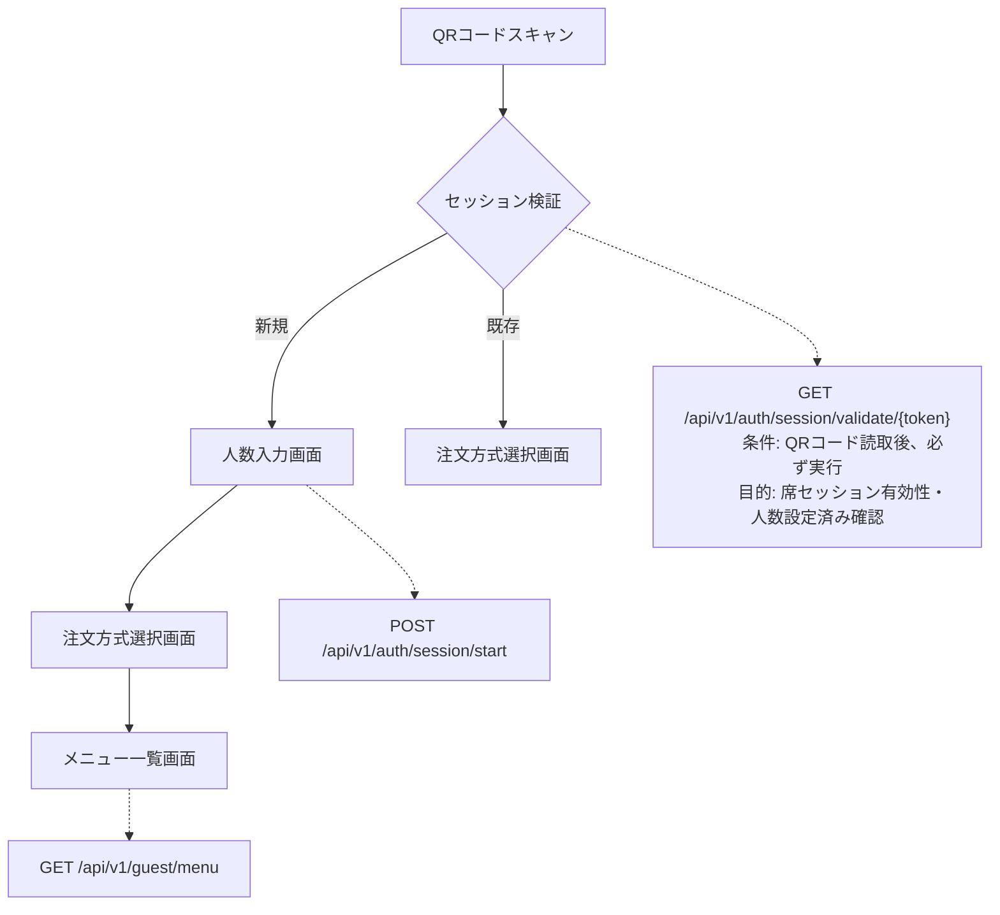
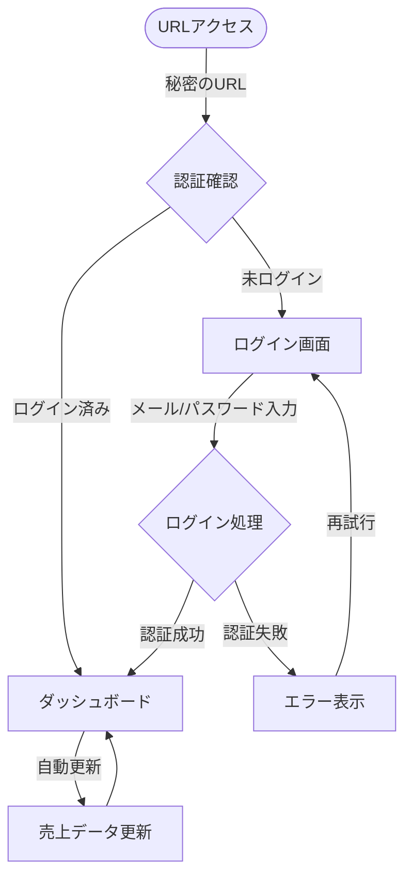
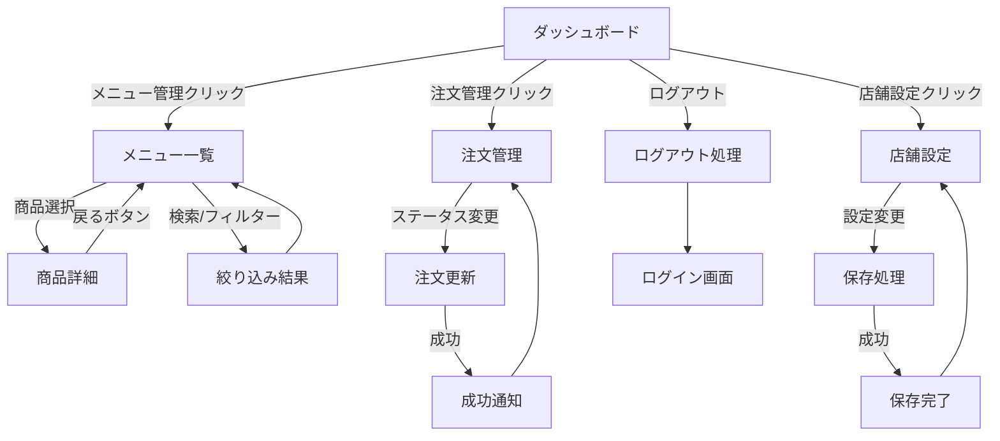
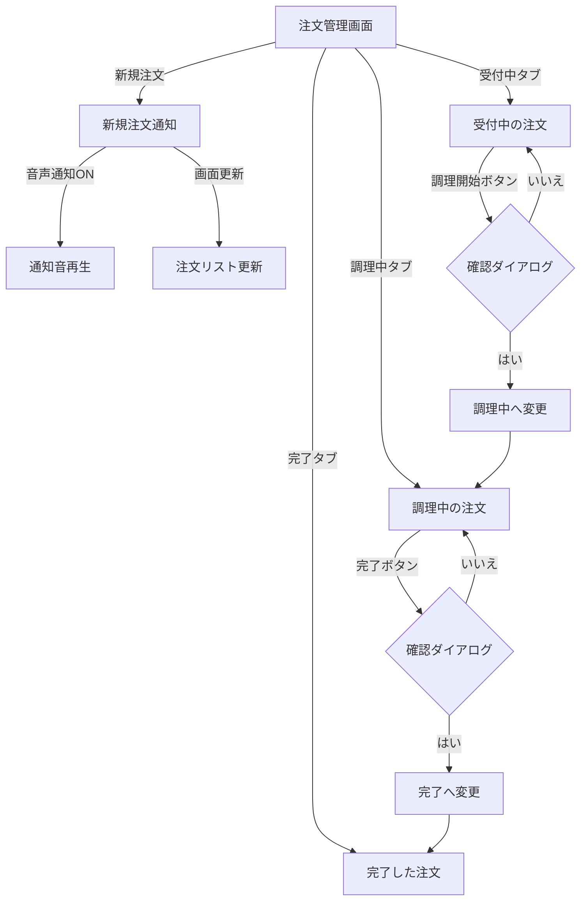
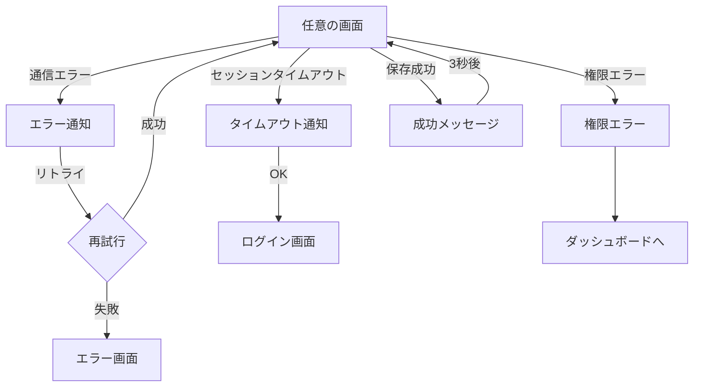

# Mobile Order System - プロジェクト全体システム概要

## 📚 目次

- [1. システム概要](#1-システム概要)
- [2. システム全体アーキテクチャ](#2-システム全体アーキテクチャ)
- [3. 画面遷移フローと発生イベント](#3-画面遷移フローと発生イベント)
  - [3.1 注文開始からメニュー表示まで](#31-注文開始からメニュー表示まで)
  - [3.2 画面デザイン仕様](#32-画面デザイン仕様)
  - [3.3 管理ポータル画面遷移フロー](#33-管理ポータル画面遷移フロー)
- [4. 2層セッション管理システム](#4-2層セッション管理システム)
  - [4.1 セッション管理の概念](#41-セッション管理の概念)
  - [4.2 第1層：席セッション](#42-第1層席セッション)
  - [4.3 第2層：個人セッション](#43-第2層個人セッション)
  - [4.4 セッション連携の仕組み](#44-セッション連携の仕組み)
- [5. change_logsテーブルとPOSポーリングシステム](#5-change_logsテーブルとposポーリングシステム)
  - [5.1 change_logsテーブルの役割](#51-change_logsテーブルの役割)
  - [5.2 POSポーリングの仕組み](#52-posポーリングの仕組み)
  - [5.3 change_logsに記録される具体例](#53-change_logsに記録される具体例)
- [6. 障害発生事例と復旧処理](#6-障害発生事例と復旧処理)
  - [6.1 事例1：インターネット回線障害](#61-事例1インターネット回線障害)
  - [6.2 事例2：Webサーバー障害](#62-事例2webサーバー障害)
- [7. システム運用のポイント](#7-システム運用のポイント)
  - [7.1 正常時の運用フロー](#71-正常時の運用フロー)
  - [7.2 監視すべき指標](#72-監視すべき指標)
  - [7.3 緊急時対応手順](#73-緊急時対応手順)
- [8. 開発・運用体制](#8-開発運用体制)
  - [8.1 役割分担](#81-役割分担)
  - [8.2 データ管理ポリシー](#82-データ管理ポリシー)

---

## 1. システム概要

Mobile Order Systemは飲食店向けのモバイル注文システムです。お客様がQRコードをスマートフォンで読み取り、メニューを閲覧・注文し、POSシステムと連携して調理指示から会計まで一貫して管理します。

### 主要な特徴
- **QRコード連携**: POSレジから発行されたQRコードで注文開始
- **2層セッション管理**: 席単位と個人端末の両方でセッション管理
- **リアルタイム同期**: POS側とクラウド側の双方向データ同期
- **障害時継続運用**: インターネット障害時もPOS単独で営業継続可能
- **多言語対応**: 日本語、英語、中国語（繁体・簡体）、韓国語

---

## 2. システム全体アーキテクチャ

```
┌─────────────────────────────────────────────────────────────────┐
│                     お客様（スマートフォン）                      │
│  QRコード読み取り → メニュー閲覧 → 注文 → 注文履歴確認           │
└─────────────────────────┬───────────────────────────────────────┘
                         │ HTTPS/API通信
                         ▼
┌─────────────────────────────────────────────────────────────────┐
│              クラウドWebシステム（Laravel）                        │
│  - 2層セッション管理（席セッション + 個人セッション）              │
│  - 注文データ管理（orders, change_logs）                        │
│  - リアルタイム在庫状況管理                                      │
└─────────────────────────┬───────────────────────────────────────┘
                         │ HTTP API（ポーリング）
                         ▼
┌─────────────────────────────────────────────────────────────────┐
│            オンプレミスPOSシステム（Delphi + FireBird）           │
│  - 商品マスター管理                                             │
│  - 注文処理・厨房出力                                           │
│  - 会計処理                                                     │
│  - ハンディ端末連携                                             │
└─────────────────────────────────────────────────────────────────┘
```

---

## 3. 画面遷移フローと発生イベント

### 3.1 注文開始からメニュー表示まで



#### 発生するイベント・API

**1. QRコードスキャン**
- **イベント**: スマートフォンカメラでQRコード読み取り
- **データ**: 席セッショントークン（例：`/s/SESSION_POS_123_20241213_120000`）

**2. セッション検証**
- **API**: `GET /api/v1/auth/session/validate/{session_token}`
- **目的**: 席セッションの有効性確認
- **レスポンス**: 
  ```json
  {
    "is_valid": true,
    "is_customer_count_set": false,
    "next_action": "input_customer_count"
  }
  ```

**3. 人数入力（初回のみ）**
- **API**: `POST /api/v1/auth/session/start`
- **パラメータ**: `customer_count`, `session_token`
- **処理**: 個人セッショントークン生成、Redisセッション作成

**4. メニュー取得**
- **API**: `GET /api/v1/guest/menu`
- **認証**: 個人セッショントークン
- **取得データ**: 商品一覧、カテゴリ、価格、在庫状況

### 3.2 画面デザイン仕様

#### 各画面で共通して使用する色とデザイン

**使用する色**
- **メインカラー**: オレンジ系（食欲を刺激する温かい色）
  - ボタンなどの主要な部分: 濃いオレンジ色
  - 選択中の項目: 薄いオレンジ色の背景
- **文字の色**:
  - 通常の文字: 濃いグレー（ほぼ黒）
  - 説明文など: 中間のグレー
  - 背景色: 薄いグレー

**文字の大きさ**
- 大きい見出し: 24px（画面タイトルなど）
- 中くらいの見出し: 18px（セクションタイトルなど）
- 通常の文字: 16px（スマートフォンで読みやすいサイズ）
- 小さい説明文: 14px
- 価格表示: 24px（太字で目立つように）

**ボタンやカードの余白**
- ボタンの最小サイズ: 44px以上（指でタップしやすい大きさ）
- カード内の余白: 上下左右16px
- 画面の端からの余白: 左右16px

#### C-001: 人数入力画面

**画面の見た目**:
- 背景は薄いグレー色
- 画面中央に白いカードが表示される（影付きで浮いているように見える）
- カードの上部に「ご利用人数を選択してください」という大きめの文字（24px）

**人数選択部分**:
- 1〜6の数字ボタンが2行3列で並んでいる
- 各ボタンは80×80pxの正方形（指でタップしやすい大きさ）
- 選択されていないボタン: 白背景にグレーの枠線
- 選択されたボタン: オレンジ色の背景に白文字
- ボタンの中の数字は大きく太字で表示

**確定ボタン**:
- カード下部に横幅いっぱいのオレンジ色のボタン
- 「次へ進む」という白い文字（18px）
- ボタンの高さは48px（タップしやすい）

#### C-003: 注文方式選択画面

**画面の見た目**:
- 背景は薄いグレー色
- 画面上部に「注文方式を選択してください」という見出し（24px）

**選択カード**:
- 2つの白いカードが縦に並んでいる（各カード高さ150px）
- カード間の間隔は24px

**上のカード（画像で選ぶ）**:
- 左側に写真アイコン（48px）
- 「画像で選ぶ」という見出し（18px、太字）
- 「商品の写真を見ながら選択できます」という説明文（14px、グレー）
- タップするとカード全体がオレンジ色の枠線で囲まれる

**下のカード（番号で入力）**:
- 左側に番号記号（#）アイコン（48px）
- 「番号で入力」という見出し（18px、太字）
- 「商品番号を直接入力して注文できます」という説明文（14px、グレー）
- タップするとカード全体がオレンジ色の枠線で囲まれる

#### C-004: メニュー画面

**画面上部のヘッダー**:
- 白い背景で画面上部に固定される（スクロールしても見える）
- 左側に店舗名、右側に「言語切替」「注文履歴」「店員呼出」ボタン（各ボタンはアイコン付き）
- ヘッダーの下には薄い影があり、浮いているように見える

**カテゴリ選択タブ**:
- ヘッダーの下に横スクロール可能なタブが並ぶ
- 「すべて」「メイン」「サイド」「ドリンク」などのカテゴリ名
- 選択中のタブ: オレンジ色の下線付き
- 選択していないタブ: グレーの文字

**商品一覧表示エリア**:
- スマートフォンでは2列、タブレットでは3列で商品カードが並ぶ
- 各商品カードには以下が表示される：
  - 上部に商品画像（横4:縦3の比率、角が少し丸い）
  - 商品名（16px、太字）
  - 商品説明（14px、グレー文字）最大2行まで表示
  - 左下に価格（24px、オレンジ色、太字）
  - 右下に「追加」ボタン（小さめのオレンジ色ボタン）
- 売り切れ商品: 画像が薄くなり「売り切れ」の文字が重なって表示

**画面下部の固定カート表示**:
- 画面最下部に常に表示される高さ80pxのエリア
- オレンジ色のグラデーション背景
- 左側にカートアイコンと「カート（3点）」の白文字
- 右側に合計金額「¥2,500」の白文字（大きめ）
- 下段に「▼ タップして注文内容を確認 ▼」の白文字
- 商品追加時: 軽く光るアニメーション効果

#### C-005: 商品詳細モーダル

**画面の表示方法**:
- 商品をタップすると画面中央にポップアップ表示
- 背景は暗くなり（半透明の黒）、モーダルに集中できる
- モーダルの幅は最大500px（画面幅に合わせて調整）

**モーダル内のレイアウト**:
- 最上部: 商品の大きな画像（横幅いっぱい）
- 右上に「×」ボタン（閉じる用）

**商品情報エリア**:
- 商品名（18px、太字）
- 商品説明（14px、グレー文字）
- 基本価格（24px、オレンジ色、太字）

**オプション選択エリア**（ある場合）:
- 「麺の硬さ」などのオプション名（16px、太字）
- 選択肢がカード形式で縦に並ぶ（各高さ44px以上）
- 選択されていない項目: 白背景にグレーの枠線
- 選択された項目: 薄いオレンジ色の背景にオレンジ色の枠線
- 各選択肢には名前と追加料金が表示

**数量選択エリア**:
- 「数量」という見出し（16px）
- 「－」ボタン（44×44px）、数量表示（大きめの数字）、「＋」ボタン（44×44px）が横並び

**カートに追加ボタン**:
- モーダル下部に横幅いっぱいのオレンジ色ボタン
- 「カートに追加（¥1,200）」のように合計金額付きの白文字

#### C-006: カート表示（展開時）

**画面の表示方法**:
- 下部のカートエリアをタップすると下から画面がスライドアップして表示
- スマートフォンでは画面全体の高さ、タブレット以上では画面の70%程度の高さ
- 背景は白色

**カート画面の上部**:
- 「カート」というタイトル（18px、太字）
- 右上に「×」ボタン（閉じる用）
- タイトル下にグレーの横線で区切り

**カート内の商品リスト**:
- 各商品が白いカード形式で表示（グレーの枠線、角が丸い）
- カード内のレイアウト：
  - 左側: 48×48pxの商品画像（小さいサムネイル）
  - 中央: 商品名（14px）と数量（12px、グレー）
  - 下部: 小計金額（16px、オレンジ色、太字）
  - 右側: ゴミ箱アイコンの削除ボタン（タップで商品削除）

**カート下部の合計表示エリア**:
- 「合計」の文字（18px）と合計金額（24px、オレンジ色、太字）が横並び
- その下に横幅いっぱいのオレンジ色ボタン
- 「注文を確定する」の白文字（18px）

#### C-008: 注文履歴画面

**画面の見た目**:
- 背景は薄いグレー色
- 画面上部に「注文履歴」というタイトル（24px）
- 注文が時系列で縦に並んで表示（新しい注文が上）

**各注文カード**:
- 白い背景のカード形式（影付き）
- カード上部に注文時刻（12px、グレー）「12:30に注文」
- **注文者識別アイコン**: 動物アイコンで誰が注文したかを表示
  - 例：🐶犬、🐱猫、🐰うさぎ、🐼パンダなど
  - 同じ端末からの注文は同じアイコンで統一

**ステータス表示**:
- 注文状況がカラフルなバッジで表示
  - 「受付中」: 黄色の背景に黒文字
  - 「調理中」: 青色の背景に白文字
  - 「完了」: 緑色の背景に白文字

**注文内容**:
- 商品名と数量のリスト（14px）
- 各商品の横に「×2」のような数量表示
- カード下部に合計金額（18px、太字）

**割り勘計算表示**:
- 画面下部に合計金額と割り勘金額を表示
- 「合計: ¥5,000」の下に「1人あたり: ¥1,250（4人で割った場合）」
- 人数は席の利用人数から自動計算

**会計ボタン**:
- 画面下部に「会計する」のオレンジ色ボタン（全注文の合計金額付き）

#### エラー・成功メッセージ

**メッセージの表示方法**:
- 画面上部に一時的に表示される通知バー
- 3秒後に自動的に消える

**メッセージの種類と色**:
- **成功メッセージ**: 薄い緑色の背景、緑色の枠線（例：「カートに追加しました」）
- **エラーメッセージ**: 薄い赤色の背景、赤色の枠線（例：「在庫がありません」）
- **警告メッセージ**: 薄い黄色の背景、黄色の枠線（例：「もうすぐ売り切れです」）
- **情報メッセージ**: 薄い青色の背景、青色の枠線（例：「新商品が追加されました」）

各メッセージには適切なアイコン（チェックマーク、×印、！マークなど）が左側に表示される

### 3.3 管理ポータル画面遷移フロー

#### 3.3.1 初回アクセスからダッシュボードまで



**ログイン処理の流れ**:
1. 秘密のURL（例：`/mo-ctrl-x7k9/`）にアクセス
2. 未ログインの場合はログイン画面表示
3. メールアドレスとパスワードで認証
4. 成功するとダッシュボードへ自動遷移
5. 失敗時はエラーメッセージ表示（「メールアドレスまたはパスワードが正しくありません」）

#### A-001: ログイン画面

**アクセスURL（セキュリティ対策）**:
- **URLの仕組み**: `https://ドメイン名/{推測困難な文字列}/`
  - 例: `https://example.com/mo-ctrl-x7k9m2p4/`
  - 「mo-ctrl-x7k9m2p4」の部分は店舗ごとに異なる秘密の文字列
- **なぜこの方式？**: 
  - 一般的な「/admin」や「/login」では悪意のある攻撃者に狙われやすい
  - 推測困難なURLにすることで、管理画面の存在自体を隠す
  - URLを知っている人だけがアクセス可能（第一の防御壁）
- **URLの管理方法**:
  - 店舗の管理者にのみ通知
  - メールやチャットでの共有は避け、安全な方法で伝達
  - 定期的に変更することも可能

**画面の見た目**:
- 背景は薄いグレー
- 画面中央に白いログインカード（影付き）
- カード上部に店舗ロゴまたはシステム名

**ログインフォーム**:
- 「メールアドレス」入力欄（アイコン付き）
- 「パスワード」入力欄（アイコン付き、目のアイコンで表示/非表示切替）
- 「ログイン状態を保持」チェックボックス
- オレンジ色の「ログイン」ボタン（横幅いっぱい）

**セキュリティ表示**:
- カード下部に「このページは保護されています」の文言
- 鍵アイコンでSSL通信を示唆

#### 3.3.2 ダッシュボードからの画面遷移



**各画面からの操作**:
- **ダッシュボード**: サイドバーメニューから各画面へ移動
- **メニュー管理**: 商品クリックで詳細表示（読み取り専用）
- **注文管理**: ステータス変更ボタンで注文状態を更新
- **店舗設定**: 各設定の保存ボタンで変更を反映

#### A-002: ダッシュボード

**画面構成**:
- 上部: ヘッダー（濃い紺色）
  - 左側: システム名/店舗名
  - 右側: ユーザー名とログアウトボタン
- 左側: サイドバーメニュー（濃い紺色、幅250px）
  - 各メニュー項目にアイコン付き
  - 選択中の項目はオレンジ色でハイライト
- 右側: メインコンテンツエリア（白背景）

**ダッシュボードの内容**:
- 上部に「本日の概要」カード群（横並び4つ）
  - 売上金額（大きな数字とアイコン）
  - 注文件数（大きな数字とアイコン）
  - 来店人数（大きな数字とアイコン）
  - 平均単価（大きな数字とアイコン）
- 中段: 時間帯別売上グラフ（折れ線グラフ）
- 下段: 人気商品ランキング（表形式）

**カードデザイン**:
- 各カードは白背景に薄い影
- 数字は32px以上の大きさで目立つように
- 前日比較を小さい文字で表示（+15%など）

#### A-003: メニュー管理（一覧）

**画面構成**:
- ページタイトル「メニュー管理」（24px）
- 検索・フィルターバー
  - 商品名検索ボックス
  - カテゴリ選択ドロップダウン
  - 在庫状況フィルター

**商品一覧テーブル**:
- 白背景のテーブル形式
- ヘッダー行は薄いグレー背景
- 各列:
  - 商品画像（50×50pxサムネイル）
  - 商品名（クリックで詳細へ）
  - カテゴリ
  - 価格
  - 在庫状況（カラーバッジで表示）
  - 操作ボタン（詳細表示）

**在庫状況の表示**:
- 「販売中」: 緑色のバッジ
- 「売り切れ」: 赤色のバッジ
- 「未入荷」: グレーのバッジ
- 「準備中」: 黄色のバッジ

#### A-004: メニュー管理（詳細）

**画面構成**:
- 上部に「< メニュー一覧に戻る」リンク
- 商品詳細カード（白背景、影付き）

**詳細情報の表示**:
- 左側: 商品画像（大きめ、300×300px）
- 右側: 商品情報
  - 商品名（24px、太字）
  - 商品説明
  - 価格
  - カテゴリ
  - 在庫状況
  - オプション一覧（ある場合）

**注意事項**:
- 「※POSシステムから商品情報を取得しているため、この画面での編集はできません」という説明文を表示

#### 3.3.3 注文管理の詳細フロー



**注文ステータス管理**:
1. **新規注文受信時**:
   - 画面上部に通知バナー表示
   - 設定に応じて音声通知
   - 注文リストが自動更新

2. **ステータス変更操作**:
   - 各注文カードのボタンをクリック
   - 確認ダイアログ表示（「本当に変更しますか？」）
   - 変更後は該当タブへ自動移動

#### A-005: 注文管理

**画面構成**:
- ページタイトル「注文管理」
- ステータスタブ（すべて/受付中/調理中/完了）

**注文リスト**:
- カード形式で縦に並ぶ（時系列）
- 各注文カード:
  - ヘッダー: 注文番号、テーブル番号、注文時刻
  - ボディ: 注文商品リスト
  - フッター: 合計金額、ステータス変更ボタン

**ステータス変更**:
- 各注文に「調理開始」「完了」などのボタン
- ボタンを押すと確認ダイアログ表示

**リアルタイム更新**:
- 新規注文時に画面上部に通知バナー表示
- 音声通知オプション（ON/OFF切替可能）

#### A-006: 店舗設定

**画面構成**:
- 設定項目がセクションごとにカード形式で表示

**基本設定カード**:
- 店舗名
- 営業時間（開始・終了時刻）
- デフォルト言語選択
- タイムゾーン設定

**表示設定カード**:
- QRコード有効時間（時間単位で設定）
- 自動ログアウト時間
- 商品画像の表示サイズ

**通知設定カード**:
- 新規注文時の通知（ON/OFF）
- 音声通知（ON/OFF）
- メール通知設定

**保存ボタン**:
- 各カード下部に「変更を保存」のオレンジ色ボタン
- 保存成功時は緑色の成功メッセージ表示

#### 3.3.4 エラー処理と通知



**エラー・通知の種類**:
- **通信エラー**: 赤色の通知バー「通信エラーが発生しました」
- **タイムアウト**: 「セッションの有効期限が切れました。再度ログインしてください」
- **権限エラー**: 「この操作を行う権限がありません」
- **成功通知**: 緑色の通知バー「保存しました」（3秒後に自動消去）

#### 3.3.5 サイドバーナビゲーション

```
┌────────────────────┐
│ 🏠 ダッシュボード   │ ← 現在地はオレンジ色
├────────────────────┤
│ 📋 メニュー管理     │
├────────────────────┤
│ 📝 注文管理        │ ← 新規注文時に赤い●バッジ
├────────────────────┤
│ ⚙️ 店舗設定        │
├────────────────────┤
│ 🚪 ログアウト       │
└────────────────────┘
```

**サイドバーの動作**:
- 現在の画面はオレンジ色でハイライト
- 新規注文がある場合は注文管理に赤いバッジ表示
- 各項目クリックで画面遷移
- モバイル時はハンバーガーメニューで開閉

#### 3.3.6 管理画面の共通デザイン

**使用する色**:
- **ヘッダー・サイドバー**: 濃い紺色（プロフェッショナルな印象）
- **メインエリア背景**: 白色
- **アクセントカラー**: オレンジ色（お客様画面と統一）
- **文字色**: 濃いグレー（読みやすさ重視）

**レイアウト構成**:
- パソコン: 左側にサイドバーメニュー、右側にメインコンテンツ
- タブレット・スマホ: ハンバーガーメニューでサイドバーを開閉

#### 3.3.7 管理画面のレスポンシブ対応

**タブレット表示（768px〜1024px）**:
- サイドバーが折りたたみ式に変更
- ハンバーガーメニューアイコンで開閉
- テーブルが横スクロール可能に

**スマートフォン表示（〜767px）**:
- サイドバーが画面全体を覆うドロワー形式
- カード類が1列表示
- テーブルがカード形式に変更（見やすさ優先）
- ボタンサイズを44px以上に拡大

---

## 4. 2層セッション管理システム

Mobile Order Systemの核となる2層セッション管理について詳しく説明します。

### 4.1 セッション管理の概念

```
      【第1層：席セッション】
      ┌─────────────────────┐
      │   テーブル8番全体   │ ← POSで生成、3時間(デフォルト)有効
      │   SESSION_POS_123   │
      └─────────────────────┘
                │
    ┌───────────┼───────────┐
    │           │           │
【第2層：個人セッション】
┌─────────┐ ┌─────────┐ ┌─────────┐
│山田さん │ │鈴木さん │ │田中さん │ ← 各端末で生成、30分有効（端末操作で30分延長）
│端末A    │ │端末B    │ │端末C    │
└─────────┘ └─────────┘ └─────────┘
```

### 4.2 第1層：席セッション

**🏪 重要：セッションID生成はPOS端末が起点**

席セッションは必ずPOS端末から開始されます。Webシステムは独自にセッションを生成することはできません。

**生成タイミング**: POS端末でスタッフが席番号を入力した時点
**生成場所**: POS端末（Delphi + FireBird）
**管理場所**: `sessions`テーブル（MySQL）にPOSからAPI経由で登録
**有効期間**: 3時間（店舗設定でカスタマイズ可能）

**生成フロー**:
```
1. スタッフがPOS端末で席番号（例：8番テーブル）を入力
2. POS端末がセッションID生成（SESSION_POS_123_20241213_120000）
3. POS → Web API呼び出し：POST /api/v1/pos/sessions
4. Webシステムのsessionsテーブルにセッション情報を記録
5. POS端末でQRコード生成・印刷
```

```sql
-- 席セッションデータ例
INSERT INTO sessions (
    session_token,
    table_number, 
    customer_count,
    status,
    expires_at
) VALUES (
    'SESSION_POS_123_20241213_120000',
    8,
    4,
    'active',
    '2024-12-13 15:00:00'
);
```

**役割**:
- 同一テーブルの利用者間で注文履歴を共有
- 会計時に席全体の注文をまとめて管理
- QRコードの有効性管理

### 4.3 第2層：個人セッション

**生成タイミング**: スマートフォンでQRコード読み取り後
**管理場所**: Redis（`guest_session:{token}`）
**有効期間**: 30分（アクティビティで自動延長）

```json
// Redisデータ例
guest_session:GUEST_abc123def456 = {
    "session_token": "SESSION_POS_123_20241213_120000",
    "guest_token": "GUEST_abc123def456",
    "device_fingerprint": "mobile_safari_ios",
    "ip_address": "192.168.1.100",
    "created_at": "2024-12-13T12:30:00Z",
    "last_activity": "2024-12-13T12:35:00Z"
}
```

**役割**:
- 個人端末の識別と不正アクセス防止
- カート内容の個人別管理
- 操作履歴の端末別記録

### 4.4 セッション連携の仕組み

```
1. QRコード読み取り
   └→ 席セッショントークン取得

2. セッション検証API呼び出し
   └→ 席セッションの有効性確認

3. 個人セッション生成
   └→ 個人セッショントークン発行
   └→ Redis登録

4. 以降のAPI呼び出し
   └→ 個人セッショントークンで認証
   └→ 席セッション情報と関連付け
```

---

## 5. change_logsテーブルとPOSポーリングシステム

### 5.1 change_logsテーブルの役割

change_logsテーブルは、Webシステム→POSシステムへのデータ同期を管理する重要なコンポーネントです。

```sql
CREATE TABLE change_logs (
    id BIGINT UNSIGNED NOT NULL AUTO_INCREMENT,
    entity_type VARCHAR(100) NOT NULL,  -- 'order'等
    entity_id BIGINT UNSIGNED NOT NULL, -- 対象データのID
    action ENUM('created', 'updated', 'deleted') NOT NULL,
    changes JSON NULL,                  -- 変更内容の詳細
    is_synced BOOLEAN DEFAULT FALSE,    -- POS同期済みフラグ
    created_at TIMESTAMP DEFAULT CURRENT_TIMESTAMP
);
```

### 5.2 POSポーリングの仕組み

**ポーリング間隔**: 5秒毎  
**API**: `GET /api/v1/pos/changes`  
**認証**: Laravel Sanctum（Bearer Token）

```
┌─────────────────┐    5秒毎ポーリング     ┌─────────────────┐
│   POSシステム   │ ───────────────────→ │  Webシステム    │
│                 │ ←─────────────────── │                 │
└─────────────────┘   変更データ取得     └─────────────────┘
```

**処理フロー**:
1. POS側から`GET /api/v1/pos/changes`を呼び出し
2. Webシステムが`is_synced = FALSE`のレコードを抽出
3. 変更データをJSON形式でPOSに返却
4. POS側でデータ処理完了後、Webシステムの`is_synced`を`TRUE`に更新

### 5.3 change_logsに記録される具体例

**新規注文の場合**:
```json
{
    "entity_type": "order",
    "entity_id": 158,
    "action": "created",
    "changes": {
        "order_id": 158,
        "table_number": 8,
        "items": [
            {
                "product_id": 23,
                "product_name": "醤油ラーメン",
                "quantity": 2,
                "unit_price": 800,
                "options": [
                    {"name": "麺の硬さ", "value": "普通"},
                    {"name": "チャーシュー", "value": "追加"}
                ]
            }
        ],
        "total_amount": 1760,
        "ordered_at": "2024-12-13T12:45:00Z"
    },
    "is_synced": false
}
```

---

## 6. 障害発生事例と復旧処理

### 6.1 事例1：インターネット回線障害

**障害シナリオ**: 店舗のインターネット回線が12:30に切断

#### 時系列での処理フロー

**12:30 - 障害発生**
```
┌─────────────────┐    ❌ 通信断絶    ┌─────────────────┐
│   POSシステム   │ ────────×──────→ │  Webシステム    │
│                 │ ←─────────×───── │                 │
└─────────────────┘                 └─────────────────┘
```
- POS側のポーリングAPIが失敗
- 新規のスマートフォン注文が受付不可
- 既存のお客様セッションは継続（ただし新規注文不可）

**12:30-14:00 - 障害継続中の運用**
```
お客様A（スマホ注文）─❌→ Webシステム接続不可
お客様B（ハンディ注文）─✅→ POSに直接注文記録
スタッフ（厨房出力）  ─✅→ POS内データで正常処理
```

- ハンディ端末経由の注文は正常処理
- POS内の`cloud_synced = FALSE`フラグで未同期データを記録
- 店舗営業は継続

**14:00 - 回線復旧**
```
┌─────────────────┐    ✅ 通信復旧    ┌─────────────────┐
│   POSシステム   │ ────────────────→ │  Webシステム    │
│                 │ ←─────────────── │                 │
└─────────────────┘                 └─────────────────┘
```

**14:00-14:05 - 自動復旧処理**
1. POS側が通信復旧を検知
2. `cloud_synced = FALSE`のデータを自動抽出
3. Webシステムに未同期データを送信
4. 双方向でデータ整合性を確認
5. 通常運用再開

### 6.2 事例2：Webサーバー障害

**障害シナリオ**: クラウドのWebサーバーが13:15にダウン

#### 時系列での処理フロー

**13:15 - 障害発生**
```
お客様（スマホ）─❌→ Webサーバー（503 Service Unavailable）
POS（ポーリング）─❌→ APIエラー（接続タイムアウト）
```
- スマートフォンからの新規アクセス不可
- 既存セッションのお客様も注文継続不可
- POSポーリングがエラーを検知

**13:15-13:45 - 障害継続中の運用**
- 全てハンディ端末での注文に切り替え
- POS内でのデータ管理は正常継続
- `cloud_synced = FALSE`で未同期データが蓄積

**13:45 - サーバー復旧**
```
システム監視アラート → 運用チームが復旧作業実施 → サービス再開
```

**13:45-14:00 - 復旧処理**
1. **Webサーバー側**:
   - 障害期間中のセッションデータを整理
   - 未完了の注文データをクリーンアップ

2. **POS側**:
   - 未同期データ（`cloud_synced = FALSE`）を抽出
   - 復旧後APIにバッチ送信
   - 商品在庫状況の同期

3. **整合性確認**:
   - 注文データの重複チェック
   - 売り切れ状況の最新化
   - QRコードセッションの有効性確認

---

## 7. システム運用のポイント

### 7.1 正常時の運用フロー

**営業開始時**:
1. POS起動 → Webシステム疎通確認
2. 商品マスター同期（必要に応じて）
3. QRコード発行準備完了

**営業中**:
- 5秒毎のPOSポーリング継続
- リアルタイム在庫状況更新
- セッション管理の自動継続

**営業終了時**:
1. 全席の注文完了確認
2. 未会計データの整理
3. 日次データバックアップ

### 7.2 監視すべき指標

**システム監視**:
- POSポーリングの成功率（95%以上維持）
- API応答時間（平均500ms以内）
- セッション有効期限の適切な管理

**ビジネス監視**:
- スマホ注文とハンディ注文の比率
- 平均注文完了時間
- ピーク時間帯の負荷状況

### 7.3 緊急時対応手順

**通信障害時**:
1. ハンディ端末での注文受付継続
2. お客様への状況説明（多言語対応）
3. 復旧後のデータ同期確認

**システム障害時**:
1. 影響範囲の迅速な特定
2. 代替手段での営業継続
3. 段階的な復旧作業実施

---

## 8. 開発・運用体制

### 8.1 役割分担

**システム提供者**:
- Webシステムの開発・保守
- 障害時の24時間対応
- システム設定の変更管理

**店舗側**:
- POS・ハンディ端末の日常運用
- お客様サポート
- 軽微なトラブルの初期対応

**POS ベンダー**:
- POS システムの保守
- API仕様の調整
- ハードウェア保守

### 8.2 データ管理ポリシー

**保持期間**:
- 注文データ: 2年間
- ログデータ: 1年間  
- セッションデータ: 利用終了後即座削除

**セキュリティ**:
- 個人特定情報は収集・保存しない
- 端末情報は匿名化して管理
- 通信は全てHTTPS暗号化

---

このドキュメントは、Mobile Order Systemの全体像を理解し、効率的な開発・運用を実現するための包括的なガイドです。技術的な詳細については、`.claude/01_development_docs/`配下の各種設計書を参照してください。
