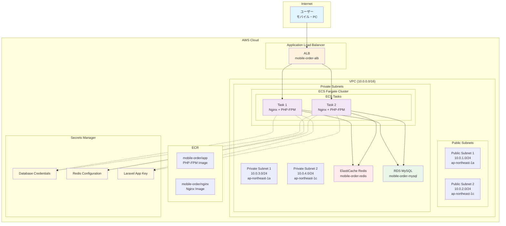

# Mobile Order System - AWS環境構築手順書

## 概要

Mobile Order SystemをAWS ECS Fargate環境にデプロイするための完全な手順書です。本システムはLaravel PHP アプリケーション、Redis、MySQL、ALBを使用したマイクロサービス アーキテクチャです。

## アーキテクチャ図



## システム構成要素

### 1. ネットワーク層
- **VPC**: アプリケーション専用の仮想プライベートクラウド（10.0.0.0/16）
- **Public Subnets**: ALBが配置される（インターネットアクセス可能）
- **Private Subnets**: アプリケーション、データベース、キャッシュが配置される（セキュアな環境）

### 2. アプリケーション層
- **ECS Fargate**: コンテナオーケストレーション（サーバーレス）
- **Application Load Balancer**: トラフィック分散とSSL終端
- **Docker Images**: NginxとPHP-FPMの2つのコンテナ

### 3. データ層
- **ElastiCache Redis**: セッション管理とキャッシュ
- **RDS MySQL**: メインデータベース
- **Secrets Manager**: 機密情報の安全な管理

## 構築手順

### Phase 1: 基盤インフラ作成

#### 1.1 VPCとネットワーク構成

VPCとサブネットは既存のものを使用しているため、新規作成は不要です：

```bash
# VPC情報確認
aws ec2 describe-vpcs --query 'Vpcs[?CidrBlock==`10.0.0.0/16`]'

# サブネット情報確認
aws ec2 describe-subnets --filters "Name=vpc-id,Values=vpc-xxxxxx" --query 'Subnets[].[SubnetId,CidrBlock,AvailabilityZone]' --output table
```

**使用リソース:**
- VPC: `vpc-0123456789abcdef0` (10.0.0.0/16)
- Private Subnet 1: `subnet-0f7bfa77c611ae4c4` (ap-northeast-1a)  
- Private Subnet 2: `subnet-0d61fdd3479dfc3dd` (ap-northeast-1c)

#### 1.2 セキュリティグループ作成

```bash
# ECS用セキュリティグループ作成
aws ec2 create-security-group \
    --group-name mobile-order-ecs-sg \
    --description "Security group for Mobile Order ECS tasks" \
    --vpc-id vpc-0123456789abcdef0

# ALBからのHTTPトラフィック許可
aws ec2 authorize-security-group-ingress \
    --group-id sg-07144d06e5a816f3b \
    --protocol tcp \
    --port 80 \
    --source-group sg-02d611335aaca752d

# DNS解決のためのルール追加（重要: Redis接続に必要）
aws ec2 authorize-security-group-ingress \
    --group-id sg-07144d06e5a816f3b \
    --protocol udp \
    --port 53 \
    --cidr 10.0.0.0/16

aws ec2 authorize-security-group-ingress \
    --group-id sg-07144d06e5a816f3b \
    --protocol tcp \
    --port 53 \
    --cidr 10.0.0.0/16
```

**重要ポイント:**
- DNS解決ルール（UDP/TCP 53番ポート）がRedis接続に必要
- ALBのセキュリティグループからのみHTTPアクセスを許可

### Phase 2: データベース・キャッシュ構築

#### 2.1 ElastiCache Redis作成

```bash
# Redis サブネットグループ作成
aws elasticache create-cache-subnet-group \
    --cache-subnet-group-name mobile-order-redis-subnet-group \
    --cache-subnet-group-description "Subnet group for Mobile Order Redis" \
    --subnet-ids subnet-0f7bfa77c611ae4c4 subnet-0d61fdd3479dfc3dd

# Redis セキュリティグループ作成
aws ec2 create-security-group \
    --group-name mobile-order-redis-sg \
    --description "Security group for Mobile Order Redis" \
    --vpc-id vpc-0123456789abcdef0

# ECSからのRedisアクセス許可
aws ec2 authorize-security-group-ingress \
    --group-id sg-redis-xxxxxx \
    --protocol tcp \
    --port 6379 \
    --source-group sg-07144d06e5a816f3b

# Redis クラスター作成
aws elasticache create-cache-cluster \
    --cache-cluster-id mobile-order-redis \
    --engine redis \
    --cache-node-type cache.t3.micro \
    --num-cache-nodes 1 \
    --cache-subnet-group-name mobile-order-redis-subnet-group \
    --security-group-ids sg-redis-xxxxxx
```

**設定値:**
- Node Type: cache.t3.micro（開発環境向け、本番では大きなインスタンス推奨）
- Engine Version: Redis 7.x
- Endpoint: `mobile-order-redis.ts4bse.0001.apne1.cache.amazonaws.com:6379`

#### 2.2 RDS MySQL作成

既存のMySQLインスタンスを使用（詳細は省略）

### Phase 3: Secrets Manager構成

機密情報を安全に管理するため、Secrets Managerに各種認証情報を保存：

```bash
# Laravel App Key作成
aws secretsmanager create-secret \
    --name "mobile-order/laravel-app-key" \
    --description "Laravel application key for Mobile Order System" \
    --secret-string '{"APP_KEY":"base64:xxxxxxxxxxxxxxxxxxxxxxxxxxxxxxxxxxxxxxxx"}'

# データベース認証情報
aws secretsmanager create-secret \
    --name "mobile-order/database" \
    --description "Database credentials for Mobile Order System" \
    --secret-string '{
        "host": "mobile-order-mysql.xxxxxxxx.ap-northeast-1.rds.amazonaws.com",
        "dbname": "mobile_order",
        "username": "admin",
        "password": "secure-password"
    }'

# Redis設定情報
aws secretsmanager create-secret \
    --name "mobile-order/redis" \
    --description "Redis configuration for Mobile Order System" \
    --secret-string '{
        "REDIS_HOST": "mobile-order-redis.ts4bse.0001.apne1.cache.amazonaws.com",
        "REDIS_PORT": "6379",
        "REDIS_PASSWORD": "",
        "REDIS_URL": "redis://mobile-order-redis.ts4bse.0001.apne1.cache.amazonaws.com:6379"
    }'
```

**重要ポイント:**
- シークレットARNの末尾文字列が変更される場合がある
- タスク定義では正確なARNを指定する必要がある

### Phase 4: ECR（Docker Registry）構築

#### 4.1 ECRリポジトリ作成

```bash
# アプリケーション用リポジトリ
aws ecr create-repository \
    --repository-name mobile-order/app \
    --region ap-northeast-1

# Nginx用リポジトリ  
aws ecr create-repository \
    --repository-name mobile-order/nginx \
    --region ap-northeast-1
```

#### 4.2 Docker認証とイメージプッシュ

```bash
# ECR認証
aws ecr get-login-password --region ap-northeast-1 | docker login --username AWS --password-stdin 670704545755.dkr.ecr.ap-northeast-1.amazonaws.com

# アプリケーションイメージビルド・プッシュ
docker build -f docker/app/Dockerfile -t mobile-order-app:latest .
docker tag mobile-order-app:latest 670704545755.dkr.ecr.ap-northeast-1.amazonaws.com/mobile-order/app:latest
docker push 670704545755.dkr.ecr.ap-northeast-1.amazonaws.com/mobile-order/app:latest

# Nginxイメージビルド・プッシュ
docker build -f docker/nginx/Dockerfile -t mobile-order-nginx:latest .
docker tag mobile-order-nginx:latest 670704545755.dkr.ecr.ap-northeast-1.amazonaws.com/mobile-order/nginx:latest
docker push 670704545755.dkr.ecr.ap-northeast-1.amazonaws.com/mobile-order/nginx:latest
```

### Phase 5: IAM権限設定

#### 5.1 ECS実行ロール作成・設定

```bash
# Secrets Manager読み取り権限をECS実行ロールに追加
aws iam attach-role-policy \
    --role-name mobile-order-ecs-execution-role \
    --policy-arn arn:aws:iam::aws:policy/SecretsManagerReadWrite
```

**重要ポイント:**
- ECS実行ロールがSecrets Managerからシークレットを読み取る権限が必要
- CloudWatch Logsへの書き込み権限も必要

### Phase 6: ECS構築

#### 6.1 ECSクラスター作成

```bash
# Fargateクラスター作成
aws ecs create-cluster \
    --cluster-name mobile-order-cluster \
    --capacity-providers FARGATE \
    --default-capacity-provider-strategy capacityProvider=FARGATE,weight=1
```

#### 6.2 CloudWatch Logs設定

```bash
# ロググループ作成
aws logs create-log-group --log-group-name /ecs/mobile-order/web
aws logs create-log-group --log-group-name /ecs/mobile-order/pos-sync  
aws logs create-log-group --log-group-name /ecs/mobile-order/worker
```

#### 6.3 タスク定義作成

タスク定義JSONファイルを作成し、以下のコマンドで登録：

```bash
aws ecs register-task-definition --cli-input-json file://task-definition.json
```

**タスク定義のポイント:**
- CPU: 512、Memory: 1024（開発環境向け）
- 2つのコンテナ: nginx（ポート80）、app（PHP-FPM）
- Secrets ManagerからDB/Redis/Laravel認証情報を注入
- CloudWatch Logsに出力設定

#### 6.4 ECSサービス作成

```bash
aws ecs create-service \
    --cluster mobile-order-cluster \
    --service-name mobile-order-web-service \
    --task-definition mobile-order-web:5 \
    --desired-count 2 \
    --launch-type FARGATE \
    --network-configuration "awsvpcConfiguration={subnets=[subnet-0f7bfa77c611ae4c4,subnet-0d61fdd3479dfc3dd],securityGroups=[sg-07144d06e5a816f3b],assignPublicIp=DISABLED}" \
    --load-balancers targetGroupArn=arn:aws:elasticloadbalancing:ap-northeast-1:670704545755:targetgroup/mobile-order-web-tg/a48e7842c0bf2670,containerName=nginx,containerPort=80
```

### Phase 7: Application Load Balancer構築

ALBは既存のものを使用：

**設定確認:**
- ALB: `mobile-order-alb-738197092.ap-northeast-1.elb.amazonaws.com`
- Target Group: `mobile-order-web-tg`
- ヘルスチェック: `/healthcheck.php` (HTTP 200)

## 重要なトラブルシューティング

### 1. Redis DNS解決エラー

**問題:** `php_network_getaddresses: getaddrinfo for redis failed: Name does not resolve`

**原因:** VPCのDNS解決設定不備

**解決策:** セキュリティグループにDNS解決ルール追加

```bash
aws ec2 authorize-security-group-ingress \
    --group-id sg-07144d06e5a816f3b \
    --protocol udp --port 53 --cidr 10.0.0.0/16

aws ec2 authorize-security-group-ingress \
    --group-id sg-07144d06e5a816f3b \
    --protocol tcp --port 53 --cidr 10.0.0.0/16
```

### 2. Secrets Manager ARN不整合

**問題:** `ResourceInitializationError: unable to pull secrets`

**原因:** シークレット再作成時にARNの末尾文字列が変更される

**解決策:** 正確なARNを確認してタスク定義を更新

```bash
# シークレットARN確認
aws secretsmanager describe-secret --secret-id "mobile-order/laravel-app-key" --query 'ARN' --output text

# タスク定義更新
aws ecs register-task-definition --cli-input-json file://updated-task-definition.json
```

### 3. Docker設定キャッシュエラー

**問題:** Laravel設定がキャッシュされて環境変数が読み込まれない

**解決策:** Dockerfileで`config:clear`を実行

```dockerfile
# Laravel最適化（本番用） - 設定キャッシュ無効、ルートとビューのみキャッシュ
RUN php artisan config:clear \
    && php artisan route:cache \
    && php artisan view:cache
```

## 運用・監視

### ログ確認

```bash
# ECSサービス状態確認
aws ecs describe-services --cluster mobile-order-cluster --services mobile-order-web-service

# CloudWatch Logsからエラー確認
aws logs get-log-events --log-group-name /ecs/mobile-order/web --log-stream-name "php-fpm/php-fpm/[TASK-ID]"

# タスク詳細確認（失敗原因調査）
aws ecs describe-tasks --cluster mobile-order-cluster --tasks [TASK-ID]
```

### スケールアウト

```bash
# サービスのタスク数増加
aws ecs update-service \
    --cluster mobile-order-cluster \
    --service mobile-order-web-service \
    --desired-count 4
```

### デプロイメント

```bash
# 新しいイメージをプッシュ後、強制デプロイ
aws ecs update-service \
    --cluster mobile-order-cluster \
    --service mobile-order-web-service \
    --force-new-deployment
```

## セキュリティ考慮事項

1. **ネットワーク分離**: プライベートサブネットでアプリケーションを実行
2. **最小権限原則**: IAMロールは必要最小限の権限のみ付与  
3. **機密情報管理**: Secrets Managerで認証情報を暗号化保存
4. **通信暗号化**: ALBでSSL/TLS終端（必要に応じて設定）
5. **セキュリティグループ**: 必要なポートのみ開放

## 本番環境向け推奨設定

1. **リソースサイジング:**
   - ECS CPU/Memory: 最低1024 CPU、2048 Memory
   - Redis: cache.r6g.large以上
   - RDS: db.t3.medium以上

2. **可用性:**
   - Multi-AZ配置
   - Auto Scaling設定
   - ALBヘルスチェック最適化

3. **監視:**
   - CloudWatch メトリクス設定
   - アラーム設定
   - X-Ray分散トレーシング

このドキュメントに従って環境構築を行うことで、Mobile Order SystemをAWS上で安全かつ効率的に運用できます。