# Mobile Order System - ECS Fargate アーキテクチャ詳細解説

## システムアーキテクチャ概要

Mobile Order SystemはAWS ECS Fargateをベースとしたコンテナ化されたマイクロサービスアーキテクチャです。本文書では、各コンポーネントの役割と相互連携について詳しく解説します。

## アーキテクチャの全体像

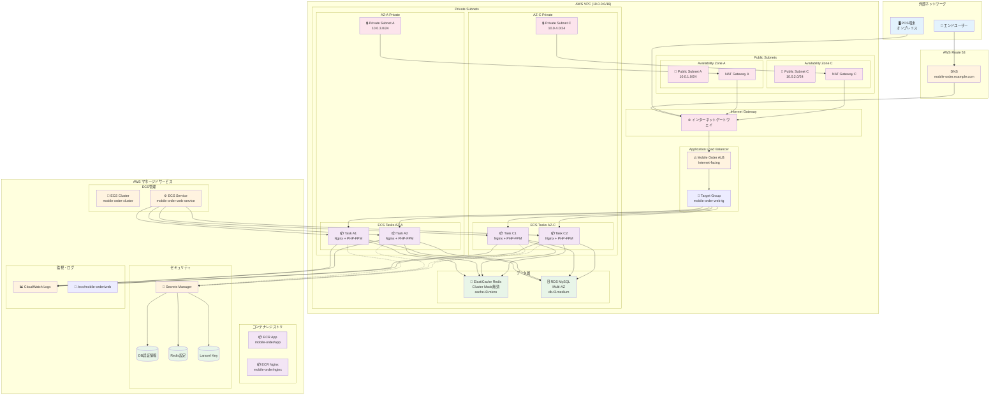

## コンポーネント詳細解説

### 1. ネットワーク層の設計思想

#### 1.1 VPC設計
```
VPC CIDR: 10.0.0.0/16 (65,536 IP addresses)
├── Public Subnet A:  10.0.1.0/24 (256 addresses) 
├── Public Subnet C:  10.0.2.0/24 (256 addresses)
├── Private Subnet A: 10.0.3.0/24 (256 addresses)
└── Private Subnet C: 10.0.4.0/24 (256 addresses)
```

**設計意図:**
- **Multi-AZ構成**: 高可用性を実現するため、ap-northeast-1aとap-northeast-1cの2つのAZに分散配置
- **パブリック/プライベート分離**: セキュリティ強化のため、インターネット向けリソース（ALB）とアプリケーション層を分離
- **スケーラビリティ**: 各サブネットに十分なIP空間を確保（将来的な拡張を考慮）

#### 1.2 セキュリティグループ設計

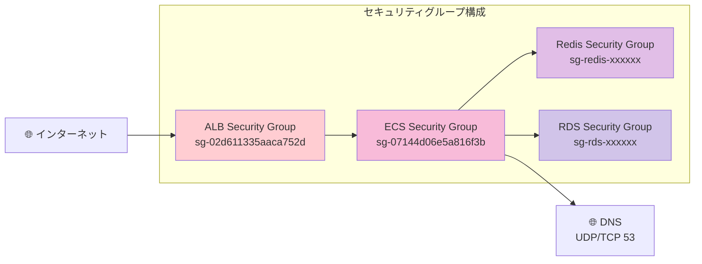

**セキュリティルール:**

1. **ALB Security Group**
   - Inbound: HTTP/HTTPS (80/443) from 0.0.0.0/0
   - Outbound: HTTP (80) to ECS Security Group

2. **ECS Security Group**
   - Inbound: HTTP (80) from ALB Security Group
   - **重要:** DNS解決用 UDP/TCP 53 from VPC CIDR (10.0.0.0/16)
   - Outbound: All traffic (443 for Secrets Manager, 3306 for MySQL, 6379 for Redis)

3. **Redis Security Group**  
   - Inbound: Redis (6379) from ECS Security Group

4. **RDS Security Group**
   - Inbound: MySQL (3306) from ECS Security Group

**重要な設計ポイント:**
- DNS解決ルール（53番ポート）がRedis接続に必須
- 最小権限原則に基づくポート開放
- セキュリティグループ間の参照による動的な許可設定

### 2. コンテナオーケストレーション層

#### 2.1 ECS Fargateアーキテクチャ

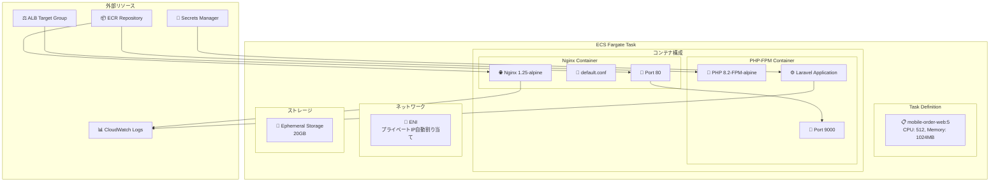

**Task Definition構成:**

```json
{
  "family": "mobile-order-web",
  "revision": 5,
  "networkMode": "awsvpc",
  "requiresCompatibilities": ["FARGATE"],
  "cpu": "512",
  "memory": "1024",
  "executionRoleArn": "arn:aws:iam::account:role/ecsExecutionRole",
  "containerDefinitions": [
    {
      "name": "nginx",
      "image": "670704545755.dkr.ecr.ap-northeast-1.amazonaws.com/mobile-order/nginx:latest",
      "portMappings": [{"containerPort": 80, "protocol": "tcp"}],
      "essential": true,
      "dependsOn": [{"containerName": "app", "condition": "START"}]
    },
    {
      "name": "app", 
      "image": "670704545755.dkr.ecr.ap-northeast-1.amazonaws.com/mobile-order/app:latest",
      "essential": true,
      "secrets": [
        {
          "name": "APP_KEY",
          "valueFrom": "arn:aws:secretsmanager:region:account:secret:mobile-order/laravel-app-key-L2wuWR:APP_KEY::"
        }
      ]
    }
  ]
}
```

**重要な設計ポイント:**

1. **Multi-Container Task**: NginxとPHP-FPMを分離してロール分担
2. **Container Dependencies**: NginxはPHP-FPMの起動を待つ
3. **Secrets Integration**: 環境変数として機密情報を注入
4. **Logging**: 各コンテナのログをCloudWatch Logsに集約

#### 2.2 ECSサービス設計

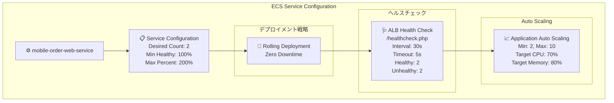

### 3. データ層アーキテクチャ

#### 3.1 ElastiCache Redis設計

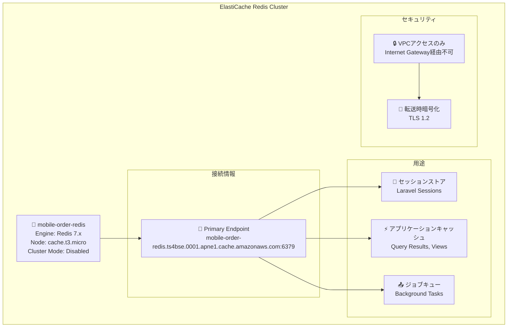

**Redis使用用途詳細:**

1. **セッション管理**: 
   - Laravel標準のセッションストレージ
   - 複数タスク間でのセッション共有
   - TTL: 30分（自動延長機能）

2. **アプリケーションキャッシュ**:
   - データベースクエリ結果のキャッシュ
   - Bladeテンプレートのコンパイル済みキャッシュ
   - APIレスポンスキャッシュ

3. **背景タスクキュー**:
   - 注文処理の非同期実行
   - メール送信キュー
   - データ同期処理

#### 3.2 RDS MySQL設計

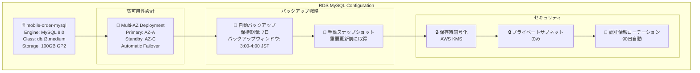

### 4. セキュリティ・機密管理層

#### 4.1 AWS Secrets Manager統合

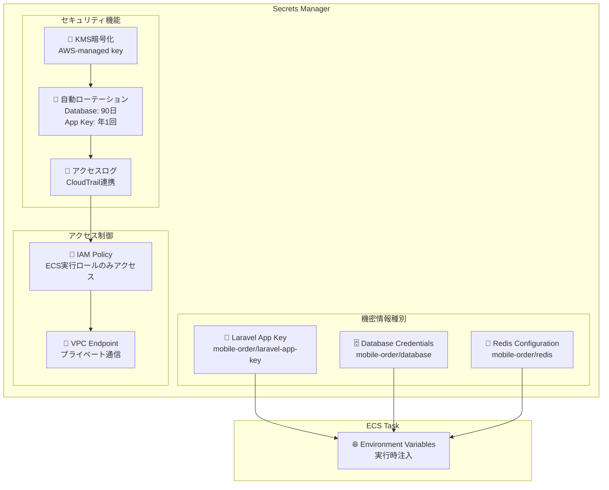

**機密情報の注入フロー:**

1. **ECSタスク起動時**:
   - ECS実行ロールがSecrets Managerにアクセス
   - VPC Endpoint経由でプライベート通信
   - 取得した値を環境変数として設定

2. **Laravel起動時**:
   - `config:clear`により設定キャッシュを無効化
   - 実行時に環境変数から設定値を読み込み
   - Redis/MySQLへの接続に使用

### 5. 監視・ログ・運用

#### 5.1 CloudWatch Logs統合

```mermaid
graph TB
    subgraph "ログ集約システム"
        subgraph "ログソース"
            NginxLogs[🌐 Nginx Access/Error Logs]
            PHPLogs[🐘 PHP-FPM Logs] 
            LaravelLogs[⚙️ Laravel Application Logs]
        end
        
        subgraph "CloudWatch Logs"
            LogGroup[📊 /ecs/mobile-order/web]
            subgraph "Log Streams"
                NginxStream[📝 nginx/nginx/[task-id]]
                PHPStream[📝 php-fpm/php-fpm/[task-id]]
            end
        end
        
        subgraph "ログ分析"
            Insights[🔍 CloudWatch Insights<br/>SQL-like Queries]
            Alarms[🚨 CloudWatch Alarms<br/>Error Rate > 5%]
            Dashboard[📈 CloudWatch Dashboard<br/>Real-time Metrics]
        end
    end
    
    NginxLogs --> NginxStream
    PHPLogs --> PHPStream
    LaravelLogs --> PHPStream
    LogGroup --> Insights
    Insights --> Alarms
    Alarms --> Dashboard
```

#### 5.2 監視メトリクス

**アプリケーションレベル:**
- レスポンス時間 (p50, p95, p99)
- エラー率 (HTTP 5xx)
- スループット (RPS)
- アクティブセッション数

**インフラレベル:**
- CPU使用率 (ECS Tasks)
- メモリ使用率 (ECS Tasks)  
- Redis接続数/応答時間
- MySQL接続数/スロークエリ

**ビジネスメトリクス:**
- 注文完了率
- カート放棄率
- 平均注文金額

## トラフィックフローの詳細

### 1. 通常のWebリクエスト

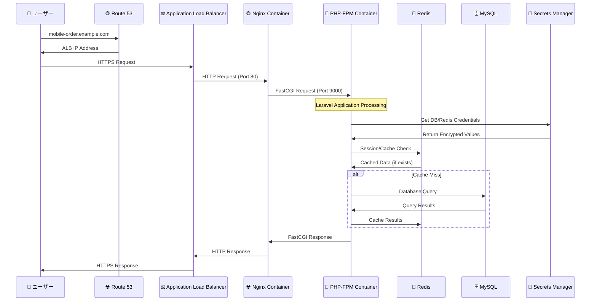

### 2. POS連携APIリクエスト

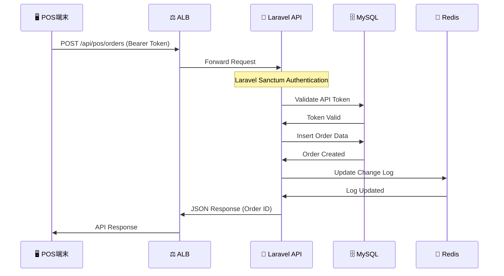

## デプロイメント戦略

### 1. Blue-Green デプロイメント

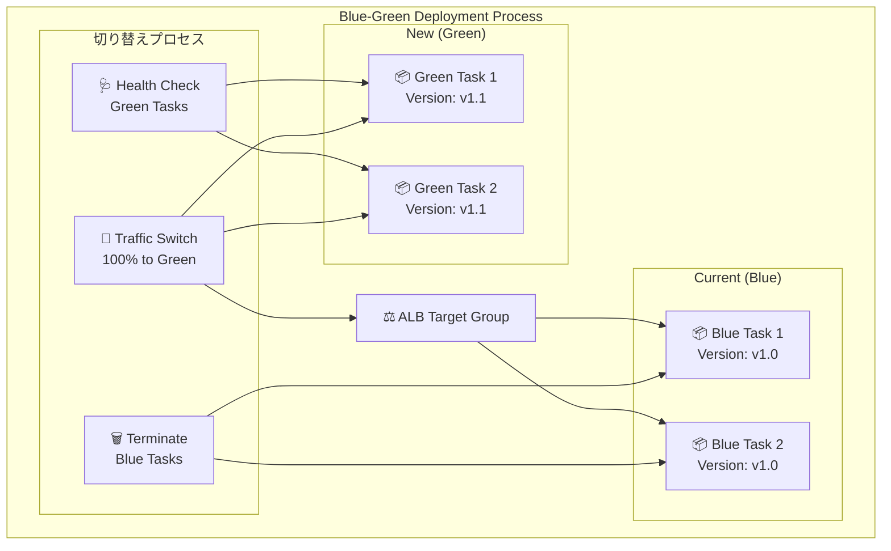

### 2. ローリングデプロイメント設定

```yaml
Service Configuration:
  DeploymentConfiguration:
    MaximumPercent: 200        # 最大タスク数を2倍まで許可
    MinimumHealthyPercent: 100 # 常に100%のタスクを健全に保つ
  
  HealthCheckGracePeriod: 60   # ヘルスチェック猶予時間
  
  DeploymentCircuitBreaker:    # 失敗時の自動ロールバック
    Enable: true
    Rollback: true
```

## 災害復旧・事業継続性

### 1. データバックアップ戦略

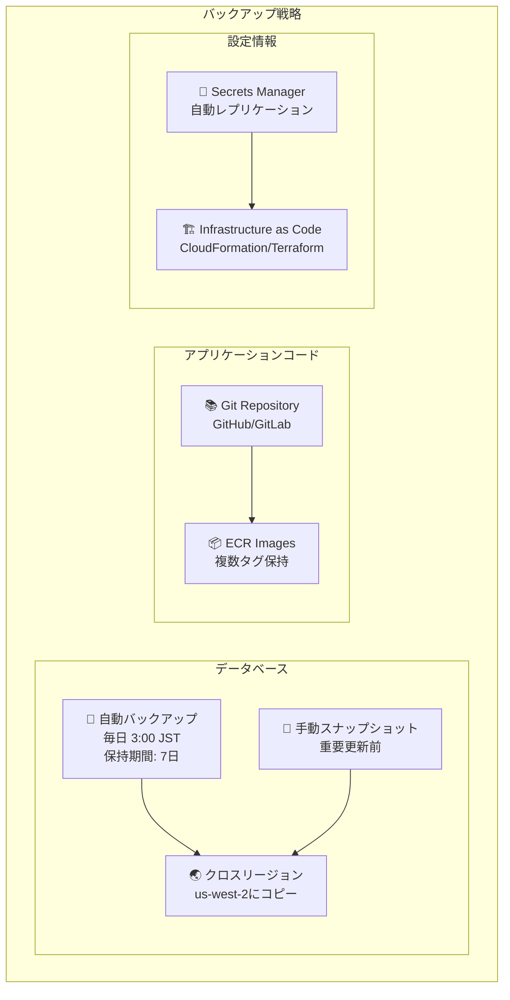

### 2. 障害時の復旧手順

1. **サービス監視**:
   - CloudWatch Alarms
   - ALB ヘルスチェック失敗
   - 応答時間劣化

2. **自動復旧**:
   - ECSサービスによる不健全タスクの自動再起動
   - Auto Scalingによる負荷分散
   - Multi-AZ RDSの自動フェイルオーバー

3. **手動介入**:
   - ログ分析による根本原因調査
   - 必要に応じてロールバック実行
   - データベーススナップショットからの復旧

## パフォーマンス最適化

### 1. アプリケーション層最適化

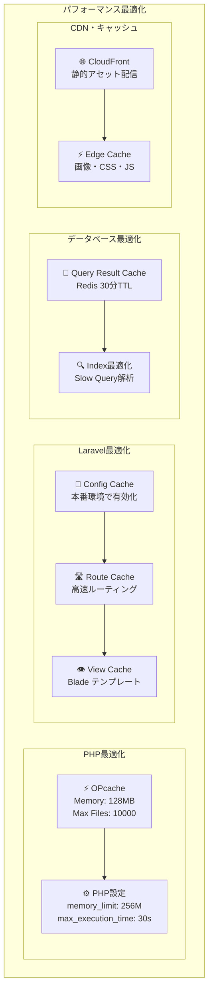

このアーキテクチャにより、Mobile Order Systemは高い可用性、セキュリティ、パフォーマンスを実現し、将来的なスケール需要にも対応可能な設計となっています。